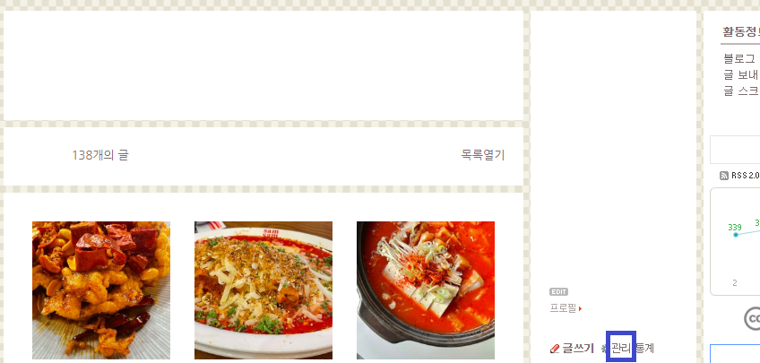
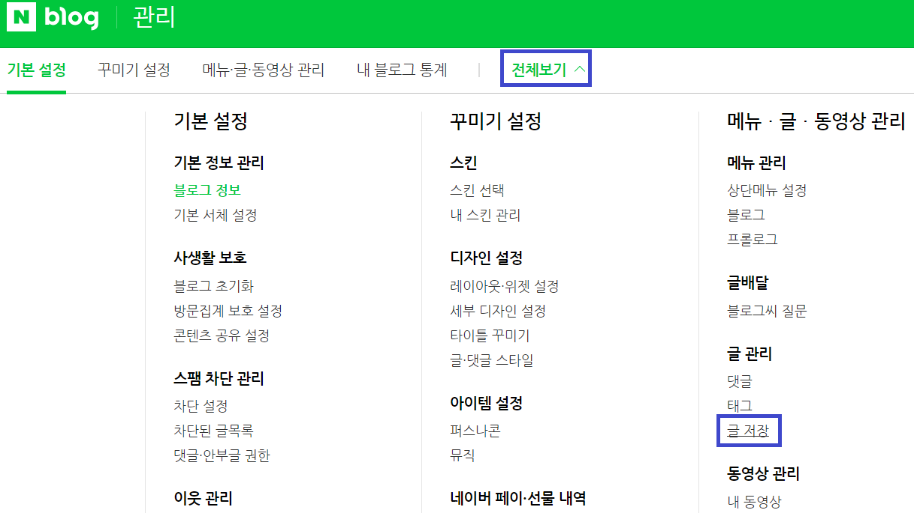
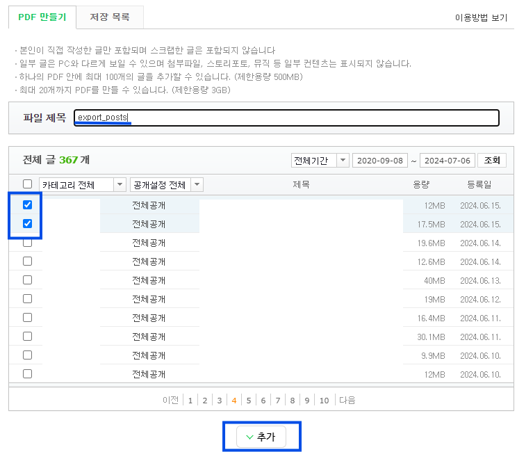
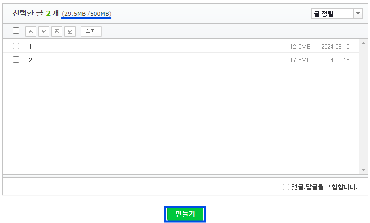
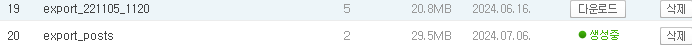
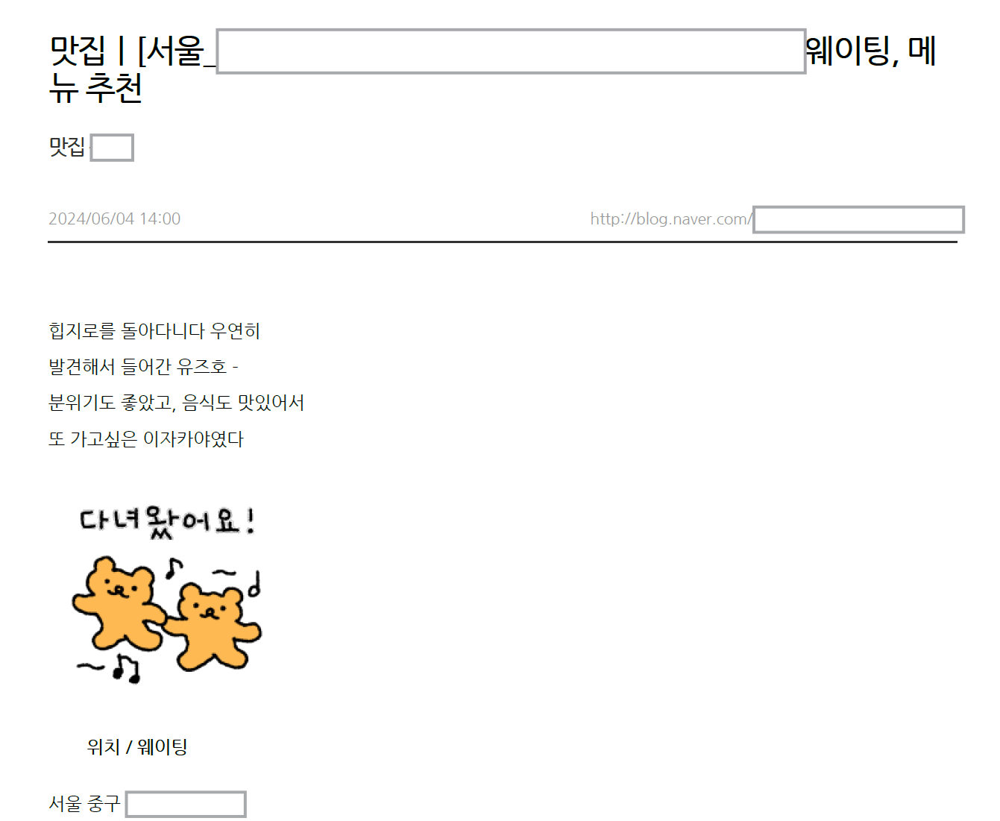
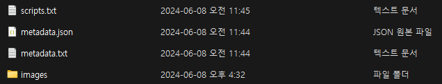

이번 프로젝트의 목표는 네이버 블로그 포스트를 티스토리로 옮기는 것이다. 프로젝트의 목표는 이렇게 한 문장으로 나타낼 수 있을 마큼 간단하나 네이버, 티스토리라는 두 서비스 제공자의 여러 제약 사항으로 자동화가 불가능하다는 것을 파악했다. 이에 완전 자동화는 못하였고... 반자동화 어플리케이션을 제작했다.

# 개요/필요 기능 정리

프로젝트가 수행하는 기능을 단계별로 나눠보면 다음과 같다.

1. 기 작성된 네이버 블로그 글을 가져와 분석한다.
   - 이 때 글뿐 아니라 이미지도 가져와야 한다.
2. 작성된 네이버 글을 참조하여 가져온 글, 그림을 이용해 포맷팅 된 상태로 재구성한다(HTML, markdown 등).
3. 새로운 글에 대해 자동으로 포스트 글로 바뀌도록 모델을 구성한다.  

4. 포맷팅된 글을 그대로 티스토리에 업로드 한다.


이를 위해 우리가 필요한 컴포넌트들은 다음과 같다.

- 네이버 블로그 글 가져오기
  - 글, 그림 백업 후 포스트별로 정리
  - 자동 네이버 포스트 캡처 기능

- 가져온 글, 그림을 참조해 글을 포맷팅 된 상태로 구성
  - 캡처된 포스트와 글을 참조해 plain text를 포멧팅된 형태로 바꿔주는 생성 모델 => 모델 A

- 새로운 글에 대해 자동으로 포스트 글을 변환
  - 이전 포스트 코드를 참조해 새로운 글에 대해 같은 형태로 바꿔주는 생성 모델 => 모델 B


이번 포스트에선 첫번째로 네이버 포스트 글/그림 백업 및 정리, 그리고 포스트 이미지 자동 캡처 기능에 대해 소개한다.

---


# Step1.  네이버 블로그 export & 데이터 정리

우선 첫번째로 네이버 블로그의 글을 빼내와야 한다.  원래는 캡처된 포스트에서 OCR을 통해 글을 가져오고자 했으니 한글에 대한 OCR 기능이 떨어지는 건지... 퀄리티가 매우 좋지 않아 포기했다.

하지만 네이버 블로그 자체적으로 포스트를 export하는 기능이 있어 이를 이용해 한번에 다량의 포스트를 PDF로 받은 뒤 PDF파일을 crop, parse해 포스트 단위로 글을 저장하는 방법을 택했다. 그리고 이 과정에서 그림도 같이 export 가능했다.

## 네이버 포스트 export 하기

네이버 블로그에선 관리자 기능 중 하나로 글 저장 기능이 있다.

- 우선 블로그에서 관리 버튼을 클릭, 관리 페이지로 간 뒤
  

- **관리 페이지** => 상단 네비게이션 바에서 **전체보기** => **글 저장**으로 이동한다.
  ****

- 글 저장 페이지에서 PDF 만들기 후 파일 제목 입력, 포스트를 여러 개 선택하여 추가를 해준다.
  

- 여러 개의 글을 한번에 저장 가능하며 각 포스트 마다 저장 용량이 나온다. 한번에 500MB까지 가능하다.
  
- 이후 저장 목록 탭으로 이동, 생성중이라고 하며 파일이 생성되고 마친 뒤 다운로드를 눌러 받아주면 된다.
  


## PDF 문서 데이터 정리

앞선 과정을 통해 받은 PDF 파일에 여러 포스트가 붙여져 있다.

이 PDF 파일을 편집하여 데이터를 뽑아내고 포스트별로 정리해야하는데 이 과정을 여기서 pymupdf 패키지를 사용하여 진행했다.

#### 1. 파일 열기

```python
base_dir = os.getcwd()
data_dir = os.path.join(base_dir, 'data')
pdf_dir = os.path.join(data_dir, 'pdf')

# 커맨드 라인으로 포스트 파일명 입력
parser = argparse.ArgumentParser()
parser.add_argument('--file_name', required=True, help='실행할 PDF 파일 이름, 확장자 제외')
args = parser.parse_args()
docs = pymupdf.open(os.path.join(pdf_dir, f'{args.file_name}.pdf'))
```

우선 os로 pdf_dir를 설정한 뒤 커맨드라인에서 파일명을 받아 PDF 파일을 열어준다. 다음으로 아래와 같이 간단히 for 문을 돌리면 PDF 페이지 단위로 정보를 추출할 수 있다.

```python
base_url = "http://blog.naver.com/{블로그 기본 주소}"

for idx, page in enumerate(docs):
    로직 진행...
```


#### 2. PDF에서 메타 데이터 추출

##### 첫 페이지

한 포스트는 여러 페이지로 구성돼있고 각 페이지를 돌며 현재 페이지가 어떤 한 포스트의 첫 페이지란걸 알아야한다. 포스트의 첫 페이지는 아래와 같이 구성된다.



이미지를 보면 발견 가능한 것이 첫 페이지엔 가장 먼저 메타 데이터가 나온다는 것이다. 먼저 이 정보를 추출할 것이다.

- `page.get_text_blocks()`를 하면 튜플의 리스트 형태로 데이터가 나온다. 위 페이지의 결과는 아래와 같다.

  ```python
  [
    (31.74799919128418,
    147.01950073242188,
    563.5275268554688,
    157.3695068359375,
    '2024/06/04 14:00\nhttp://blog.naver.com/{블로그 주소}\n',
    0,
    0),
   (31.74799919128418,
    43.086669921875,
    551.9480590820312,
    86.211669921875,
    '맛집ㅣ[서울_ ... 웨이팅, 메\n뉴 추천\n뉴 추천\n',
    1,
    0),
  
    ...
  
    (31.74799919128418,
    488.4794616699219,
    141.5570068359375,
    500.5544738769531,
    '서울 중구 ...\n',
    8,
    0)
  ]
  ```

  위 예시를 보면 페이지 내에서의 (x, y 두 점의 좌표 값 4개, 텍스트, 인덱스, _ ) 이런 형식의 튜플인 것을 알 수 있다.

- 여기서 포스트의 첫 페이지와 달리 일반 페이지라면 첫번째 튜플에 블로그 URL이 있지 않을 것이다. 따라서 `if base_url in page.get_text_blocks()[0][4]`, 즉 블로그 url의 일부가 첫 블록 텍스트 부분에 속한다면 이 페이지는 첫 페이지라는 의미이다.  

  - 따라서 저 조건이 True라면 여러 메타 데이터를 뽑아낼 수 있다. 아래와 같이 추출한다.
    ```python
    if base_url in page.get_text_blocks()[0][4]:
        post_meta_dict = dict() # 메타 데이터 딕셔너리 생성
        ## Get Post metadata
        post_meta = page.get_text_blocks()[0][4].split("\n")
        post_meta_dict["post_datetime"] = post_meta[0].replace("/", "-")
        post_meta_dict["post_date"] = post_meta_dict["post_datetime"].split()[0]
        post_meta_dict["post_time"] = post_meta_dict["post_datetime"].split()[1]
        post_meta_dict["post_id"] = post_meta[1].split("/")[-1]
        post_meta_dict["post_url"] = post_meta[1]
        post_meta_dict["post_category"] = ''.join(list(dict.fromkeys(page.get_text_blocks()[2][4].split("\n"))))
        post_meta_dict["post_title"] = ''.join(list(dict.fromkeys(page.get_text_blocks()[1][4].split("\n"))))
    ```

  - 그리고 만들어준 메타 데이터를 로컬에 저장한다. 이 때 포스트명으로 폴더를 하나 만든뒤 `metadata.txt`, `metadata.json`으로 메타 데이터들을 해당 경로에 저장한다.
    ```python
    file_name = post_meta_dict["post_date"] + "_" + post_meta_dict["post_id"]  + "_" + post_meta_dict["post_title"]
    cur_path = os.path.join(post_dir, file_name).replace("/", "_").replace("?", "").strip() #  현재 포스트 제목으로 새 경로 지정
    if idx == 0:
        prv_path = cur_path
    
    if os.path.exists(cur_path) == False: # 위 경로로 폴더 생성
        os.mkdir(cur_path)
    with open(os.path.join(cur_path, "metadata.txt"), "wb") as meta_txt: # 텍스트로 추출, 저장
        for k, v in post_meta_dict.items():
            meta_txt.write(f"{k}: {v}".encode("utf8"))
            meta_txt.write(bytes((12,)))
        meta_txt.close()
    
    with open(os.path.join(cur_path, "metadata.json"), "w") as meta_json: # JSON도 저장
        json.dump(post_meta_dict, meta_json)
        meta_json.close()
    ```

  - 마지막으로 현재 페이지가 어떤 현재 포스트의 첫 페이지라는 것을 마킹하기 위해 현재 post_id를 cur_post_id로 저장한다. 참고로 post_id는 블로그 포스트 URL에 있는 숫자 값이다.

    - 만약 포스트들의 첫페이지라면 prv_post_id도 같이 초기화 해준다. 
      ```python
      if idx == 0: # 전체 PDF  첫 페이지라면 cur_post_id, prv_post_id 둘다 현재의 post_id로
          cur_post_id = prv_post_id = post_meta_dict['post_id']
      else: #현재 포스트의 id를 위에서 추출한 메타 데이터에서 가져오기
          cur_post_id = post_meta_dict['post_id']
      first_page = True # 첫 페이지 마킹
      print(idx, post_meta_dict["post_title"])
      print(cur_path, prv_path, '\n')
      ```

    

##### 페이지 스크립트(텍스트) 추출

첫 페이지이든 아니든 스크립트는 존재할 것이며 이 정보도 따로 저장, export를 진행한다. 텍스트들을 저장할 리스트를 초기화 한 뒤에 아래 for 문으로 텍스트 블록들을 넣어준다.

```python
for k, b in enumerate(page.get_text_blocks()):
    if k == len(page.get_text_blocks()) - 1: # 마지막 블록은 스킵
        continue
    elif first_page == True and k < 3: # 본 페이지가 첫 페이지일 경우 3번째 블록까지는 스킵(제목 등 본문은 아님)
        continue
    else:
        cur_text = list(dict.fromkeys(b[4].split("\n")[:-1])) # 중복된 문장 제거, 마지막 빈칸 제거
        if len(cur_text) > 1: # 문장들 사이에 겹침이 생기면 문장이 1개 이상이 됨, 겹친것 제거 후 한문장으로
            cur_text = merge_strings(cur_text) 
        cur_text_blocks.append(cur_text)
    prv_path = cur_path
```

이유는 모르겠으나 get_text_blocks()으로 가져온 텍스트들이 가끔 서로 겹쳐져 있는 경우가 있는데 그 경우 merge_strings이란 함수를 정의해 겹친 것을 제거해줬다.


##### 사진 저장

한 페이지 내에도 여러 사진들이 있는 데 `page.get_images()` 함수로 이미지 리스트들을 가져올 수 있다. 이후 이미지 객체를 pymupdf.Pixmap 라는 내장된 함수들로 프로세싱한 뒤 현재 경로에 저장한다.
```python 
for image_index, img in enumerate(page.get_images(), start=1): # enumerate the image list
    xref = img[0] # get the XREF of the image
    pix = pymupdf.Pixmap(docs, xref) # create a Pixmap

    if pix.n - pix.alpha > 3: # CMYK: convert to RGB first
        pix = pymupdf.Pixmap(pymupdf.csRGB, pix)

    if os.path.exists(os.path.join(cur_path, 'images')) == False:
        os.mkdir(os.path.join(cur_path, 'images'))
    pix.save(os.path.join(cur_path, f'images/img_{str(idx).rjust(2, "0")}_{image_index}.png')) # save the image as png
    pix = None
```


##### 스크립트 저장

위와 같이 진행하다가 마지막 페이지를 넘어가서 그 다음 포스트의 첫 페이지로 진입했다면 스크립트 파일도 경로에 저장한다.
```python
if prv_post_id != cur_post_id and len(os.listdir(prv_path)) < 6:
    with open(os.path.join(prv_path, "scripts.txt"), "wb") as scripts_txt:
        for j, block in enumerate(cur_text_blocks):
            if block[0][-1] == "?":
                cur_txt = block[0][:-1]
            else:
                cur_txt = block[0]
            cur_txt = cur_txt + "\n"
            scripts_txt.write(cur_txt.encode("utf8"))
        scripts_txt.close()

    ## 스크립트를 저장할 때 스크린 캡처도 같이 진행
    screen_capture_loop(post_dir, prv_post_id)
    reindex_images(post_dir, prv_post_id)
    cur_text_blocks = []
```

이렇게 되면 포스트 별로 다음과 같이 4개의 데이터가 export된다.



그리고 이 때 마지막으로 아래에서 이어 설명할 포스트 자동 스크린 캡처(`screen_capture_loop(post_dir, prv_post_id))`도 같이 진행한다. 


---


# Step2.  네이버 블로그 포스트 자동 캡쳐

블로그 포스트 글은 특정한 포맷으로(HTML, markdown) 여러 스타일이 지정돼있기어 plain text만 가지고 원래 글과 비슷하게 만들기 힘들다. 그리고 추출한 PDF 역시 포맷이 거의 없는 상태였다. 

따라서 생각한 것이 블로그 스크린샷을 찍은 후 이미지 분석이 가능한 LLM 모델을 사용해 HTML 포맷으로 최대한 원래 포스트와 유사하게 작성하게 하는 것이다.이를 위해 블로그 전체를 스크린샷으로 저장하는 기능이 필요했고, 자동으로 웹페이지 전체를 스크린샷해주는 기능을 서치했지만 **결국엔 스스로 기능개발을 진행했다..ㅜㅜ**

블로그 전체를 스크린샷으로 저장하기 위해 구현한 기능을 설명하기 앞서 여러가지 스크린샷 기능이 있는 패키를 시도했지만 잘 되지 않았다.

- selenium: 가장 유명하고 많이 쓰이는 웹페이지 테스팅을 위한 자동화 패키지이다. 웹페이지 연결, 스크린 캡처는 잘 되지만 스크롤을 내리는 기능이 안된다. 
- playwright, pypeteer, screenshotone 등 기타 다른 패키지도 아예 기능하지 않거나 스크롤 이동 등 기타 기능이 마땅히 잘되지 않았다.

**결국 찾아낸 방법은 selenium을 통해 url을 새창으로 열고 pyautogui를 이용해 마우스를 직접 컨트롤하며 여러 화면으로 잘라 캡처하는 것이다.**


##### selenium

우선 셀레늄으로 chrome 드라이버를 설치한뒤 페이지를 열어 최대 창크기를 해준다.

```python
from selenium import webdriver
from selenium.webdriver.chrome.options import Options

options = Options()
driver = webdriver.Chrome()
driver.get(f"https://blog.naver.com/{blog_id}/{post_id}")
driver.maximize_window()
```


##### pyautogui

다음으로 pyautogui를 사용해 직접 마우스를 제어하며 캡처 - 스크롤을 반복한다. 2개의 함수를 선언해 loop로 한 페이지의 처음부터 끝까지 진행했다.

```python
def screen_area_capture(base_win, start_point, end_point, data_dir, file_name):
    if base_win.isActive == False:
        try:
            base_win.activate()
        except:
            pass
    img = ImageGrab.grab(bbox = (start_point[0], start_point[1], end_point[0], end_point[1]))
    img.save(os.path.join(data_dir, file_name))
    # img = Image.open(os.path.join(data_dir, 'test_pil.png'))

def capture_and_compare(base_win, idx, data_dir):
    if idx == 1:
        time.sleep(2)
        if os.path.exists(os.path.join(data_dir, "screen_captures")) == False:
            os.mkdir(os.path.join(data_dir, "screen_captures"))

    before = pg.screenshot().crop((0, 100, 2400, 800))
    screen_area_capture(
        base_win, 
        (460 , 1025 if idx == 1 else 377), 
        (1600, 1605),
        data_dir = os.path.join(data_dir, "screen_captures"),
        file_name = f"{idx}.png"
    )
    pg.moveTo(400, 1000)
    time.sleep(.04)
    pg.click()
    time.sleep(.04)

    pg.scroll(-737)
    time.sleep(.04) 
    after = pg.screenshot().crop((0, 100, 2400, 800))
    return before == after  # 두 스크린샷 비교
```

코드가 길지만 차례대로 설명하자면...

1. 인덱스를 1부터 외부로 받아 한번의 캡처를 진행한다. 
2. 스크린 캡처한 이미지들을 저장하기 위해 screen_captures라는 경로를 만들어 준다.
   - 웹페이지 로딩을 위해 우선 idx==1 이라면 2초 쉬어준다.
3. 이후 특정 영역을 캡처해준뒤 before에 넣는다.
4. screen_area_capture 함수로 특정 좌표영역을 캡처 후 screen_captures 로컬 폴더에 저장한다.
   - PIL의 ImageGrab이라는 클래스를 사용해 특정 픽셀 좌표 바운더리 안쪽만 캡처한다.
5. pyautogui를 이용해 특정 좌표만큼 스크롤을 내린다.
   - 이 픽셀 좌표는 사용자 화면에 따라 다를 것이다. 조절이 필요하다.
6. before와 같은 캡처해준 뒤 after 변수에 넣는다.
7. before와 after가 같은지 다른지 결과를 반환한다.

이후 함수를 나와서 before와 after가 같다면, 즉 웹페이지의 스크롤을 내려도 스크린 변화가 없어졌다면 loop를 멈춘다.


##### 캡처 조각 저장 및 스크린 캡처 이어 붙이기

루프를 돌면서 캡처할 때 마다 post의 경로에 들어가 캡처한 이미지를 저장해준다. 바운딩 박스 좌표와 ImageGrab을 사용해 얻은 img 객체의 save 메서드를 사용하면 간단하게 저장된다.

```python
img = ImageGrab.grab(bbox = (start_point[0], start_point[1], end_point[0], end_point[1]))
img.save(os.path.join(data_dir, file_name))
```

마지막으로 조각조각 캡처한 이미지들을 위아래로 이어 붙여준다. 두 이미지를 불러와 위아래로 붙여주는 concat_img_vertical 이라는 함수를 간단히 정의해 사용했다. 그러면 전체 스크린 캡처가 완성된다.

```python
def concat_img_vertical(image1, image2):
    # 이미지 사이즈 참조
    width1, height1 = image1.size
    width2, height2 = image2.size

    # 두 이미지의 최대 높이, 너비를 계산
    result_width = max(width1, width2)
    result_height = height1 + height2

    # 새 이미지 객체 생성 후 두 이미지 붙여넣기
    result_image = Image.new('RGB', (result_width, result_height))
    result_image.paste(image1, (0, 0))
    result_image.paste(image2, (0, height1))

    # 결과 이미지 반환
    return result_image

num_imgs = len(os.listdir(os.path.join(post_dir, cur_post_dir, "screen_captures")))
for i in range(0, num_imgs - 3, 3):
    if i + 2  > num_imgs:
        break
    image1 = Image.open(os.path.join(post_dir, cur_post_dir, f"screen_captures/{str(i + 1)}.png"))
    image2 = Image.open(os.path.join(post_dir, cur_post_dir, f"screen_captures/{str(i + 2)}.png"))
    image3 = Image.open(os.path.join(post_dir, cur_post_dir, f"screen_captures/{str(i + 3)}.png"))
    if i == 0:
        concat_img = concat_img_vertical(image1=image1, image2=image2)
        concat_img = concat_img_vertical(image1=concat_img, image2=image3)
    else:
        concat_img = concat_img_vertical(image1=concat_img, image2=image1)
        concat_img = concat_img_vertical(image1=concat_img, image2=image2)
        concat_img = concat_img_vertical(image1=concat_img, image2=image3)
concat_img.save(os.path.join(post_dir, cur_post_dir, 'concat_screen_capture.png'))
```


<hr>

다음 포스트에선 만든 포스트 캡처 이미지를 분석해서 스크립트를 이미지 내의 양식과 비슷하게 만드는 모델을 소개할 예정이다.

<br>

<br>


<hr data-ke-style="style4"/>

> 문서 및 링크

- 본 프로젝트 Github Repo [[🔗](https://github.com/lymanstudio/proj_blog_post_gen)]
