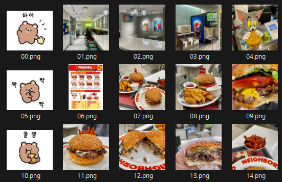
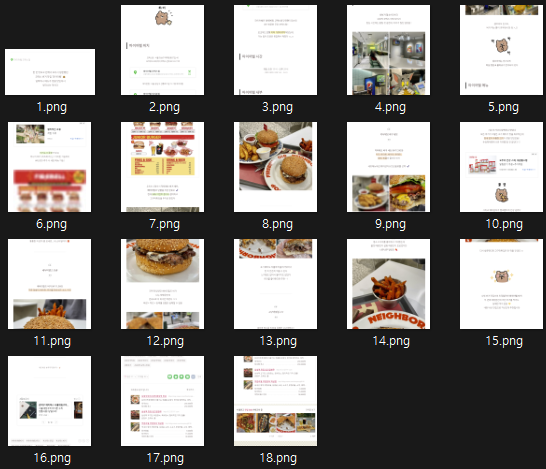
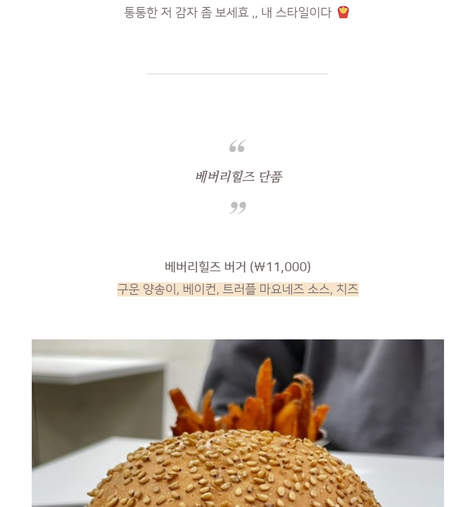

[앞선 포스트](https://lymanstudio.github.io/application/blog_gen_1/)에서 데이터를 정리하기 위해 

1. 네이버 블로그 export & 데이터 정리
2. 네이버 블로그 포스트 자동 캡쳐

를 진행하여 스크립트 데이터, 이미지 데이터, 포스트 화면 캡처 이미지를 얻었다.

각 데이터의 예시는 다음과 같다.

> 스크립트

```
한 번 맛보고 반해서 또다시 방문했던
코엑스 버거 맛집 '파이어벨' 
담백하니 메뉴가 정말 맛있어서
생각나는 맛이다
파이어벨 위치

...(중략)

두 번째 재방문인데 어떤 버거를 먹어도
실패한 적이 없음 
내돈 내산 맛집으로 자신있게 추천합니당
내돈내산 솔직후기입니다 - ☝
```


> 이미지 파일




> 포스트 캡처 이미지




이번 글에선 얻은 **포스트 캡처 이미지**와 **스크립트**로 이미지에 있는 모습과 거의 동일하게 HTML로 구성된 스크립트 코드를 생성하는 과정에 대해 소개한다.

---


# Step3.  멀티모달 LLM을 사용한 이미지 분석&HTML 코드 생성 모델

분석에 사용할 블로그 포스트는 단순한 plain text로 구성되어 있지 않고 HTML기반의 문서로 다음과 같은 특징이 있다.

- h(헤더), hr(수평 선), br(줄바꿈) 등 다양한 태그가 사용되어 있다. 

- 거의 대부분의 본문 글은 가운데 정렬되어있다.

- 강조를 위해 곳곳에 서식이 가미된 텍스트가 있으며 이는 inline CSS style을 사용한 것으로 보인다.

  💡) inline CSS 스타일은 일반적으로 HTML 파일에서 `<head>` 부분에 스타일을 미리 정의하고 `<body>`에서 정의된 스타일을 불러오는 것이 아닌 본문의 한 줄에서 직접 스타일을 지정하는 것을 의미한다. `<span style="color: blue; font-style: italic;">[ 스타일 지정 ]</span>` 이렇게 적용하면 <span style="color: blue; font-style: italic;"> [ 스타일 지정 ]</span>와 같이 꾸밀 수 있다.

이를 위해  우리가 할 일은 1. 이미지 분석이 가능한 멀티모달 모델을 사용하여 2. 각 이미지를 순회하면서 스크립트와 같이 분석해 3. 스크립트의 내용을 이미지 내의 본문과 매칭하여 적절한 HTML 코드로 변환해주는 모델을 만들 것이다.


## 멀티 모달 LLM 모델 선택

이미지 분석이 가능한 모델을 사용하기 위해 gpt-4o 모델을 이용했다. 

모델을 작성하기 앞서 가장 먼저 생각이 든 모델은 gpt-4-vision-preview 였으나 gpt-4o와 비교해 가성비가 좋지 않았고 json format지원이 안됐다.

그렇다면 vision이 지원되는 모델은 gpt-4o와 gpt-4-turbo였는데 두 모델을 직접 사용해 보기 위해 특정 캡처에 대해 분석을 진행해봤다. 뒤에서 나올 스크립트를 사용했다.




위 포스트에 대해 HTML로 코드를 변환해달라고 요청했으며 두 모델의 결과는 다음과 같다.

>  gpt-4o

<center>통통한 저 감자 좀 보세효 ,, 내 스타일이다</center>
<br><br>
<hr data-ke-style="style3"/>
<center><h3><span style="color: darkgray; font-style: italic;"> 베버리힐즈 단품 </span></h3> </center>
<hr data-ke-style="style3"/>
<br><br>
<center>베버리힐즈 버거 (₩11,000)</center>
<center>구운 양송이, 베이컨, 트러플 마요네즈 소스, 치즈</center>
((베버리힐즈 버거 사진))

<br>

> gpt-4-turbo

<center>통통한 저 감자 좀 보세요,, 내 스타일이다 ❤</center><hr><center>베버리힐즈 단품</center><center>(((베버리힐즈 버거 사진)))</center><center>베버리힐즈 버거 (₩11,000)</center><center>구운 양송이, 베이컨, 트러플 마요네즈 소스, 치즈</center>


<br>

신기하게도 결과는 gpt-4o가 더 좋았다. 두 모델 모두 inline CSS style 적용은 못했지만 gpt-4o는 헤더를 파악해 구분을 주었으며`<br>`도 중간에 적절히 넣어주었다. 다른 이미지에 대해서도 비슷한 결과들이 나왔으며 심지어 더 빠르게 결과가 나왔다. **결과적으로 베이스 LM은 gpt-4o로 선택했다.**


## 전체 모델 구성

포스트 전체 이미지를 한번에 입력으로 넣어주면 좋겠지만 그렇게 되면 입력 토큰의 limit에 걸릴 수도 있고 LLM모델이 분석을 잘 수행하지 못할 가능성이 높다. 입력 프롬프트가 길어지면 모델이 중간의 내용을 망각하는 이유와 같을 것이다. 따라서 **하나씩 차례대로 블로그 이미지의 부분에 대한 분석을 요청하고 모든 부분에 대해 for loop로 순회하면서 결과를 얻어야 한다.**


한편 블로그 포스트 캡처본은 특정 픽셀 높이 만큼 잘려져 있어 글이나 사진이 중간에 잘려 있는 경우가 많다. 따라서 한장씩 돌아가며 진행하다보면 이미지 분석이 안될 경우가 많다.

이를 방지하기 위해 부분 이미지가 들어갈 때 현재 이미지와 아래의 이미지를 이어 붙여줘 정보가 잘리지 않았을 이미지를 넣어줬다(이렇게 하면 현재 이미지가 다음 이미지에도 다시 들어가니 중복된 결과가 나오는 단점이 있지만 데이터가 아예 유실되는 것 보다는 낫다고 판단함).

결과적으로 다음과 같이 모델을 구성했다. 

```python
def encode_image(img_path):
    """
    Endoces an image to base64 string    
    """
    with open(img_path, 'rb') as img_file:
        return base64.b64encode(img_file.read()).decode('utf-8')

def generate(img_idx, cur_post_dir, script, prv_result_dict = None):
    # 현재 이미지와 다음 이미지 이어 붙이기
    img_dir = os.path.join(cur_post_dir,"screen_captures")
    if img_idx == 0:
        concat_img = Image.open(os.path.join(img_dir, f"{str(img_idx + 1)}.png"))
    elif img_idx > len(os.listdir(img_dir)) - 3:
        return None
    else:
        img_obj1 = Image.open(os.path.join(img_dir, f"{str(img_idx)}.png"))
        img_obj2 = Image.open(os.path.join(img_dir, f"{str(img_idx + 1)}.png"))
        concat_img = concat_img_vertical(img_obj1, img_obj2)

    concat_img.save(os.path.join(cur_post_dir,"temp.png")) # 이어 붙인 이미지를 임시 이미지로 저장
    img_obj = encode_image(os.path.join(cur_post_dir,"temp.png")) # 인코딩 된 이미지 객체
    script = get_script(cur_post_dir) # 스크립트 가져오기
    result = get_response( # 실제 분석을 위한 openai API 호출
        img_obj=img_obj,
        script = script,
        prv_source = '' if img_idx == 0 else prv_result_dict['출력 소스 코드'],
        prv_used_script = '' if img_idx == 0 else prv_result_dict['현재까지 사용한 전체 스크립트']
    )
    
    try:
        result_dict = json.loads(result)
    except:
        print(result)
    return result_dict
```

generate 함수에선 한 이미지의 인덱스를 받아 현재 이미지를 불러오고 다름 이미지와 이어 붙여준다.

이어 붙인 이미지와 불러온 스크립트, 그리고 이전 결과(prv_result_dict)를 모델에 입력으로 넣어 현재 이미지에 대한 결과 소스 코드를 얻어 return 한다.

<br>

## 프롬프트 생성 및 모델 구현

다음으로 앞선 generate 함수에서 중간에 들어가는 LLM 모델에 질의, 결과를 얻어오는 get_response 함수를 작성해야 한다. 

우리가 작성할 모델은 포스트 이미지와 스크립트, 그리고 이전 call에서 사용한 스크립트와 결과를 입력으로 받아 현재 이미지에 대해 새로운 소스코드를 출력으로 내보내는 모델이다. 프롬프트에 앞선 요구사항을 모두 담았으며 한글로 자세하게 요구사항을 작성했다.

```py
f'''
너의 임무는 입력 포스트 이미지에 있는 글을 스크립트를 참조해서 HTML 소스코드로 변환하는 거야.

포스트 내에 있는 텍스트로 된 본문은 아래 '스크립트'와 같아.
입력 이미지에서 스크립트를 참조해서 가장 비슷한 문장을 찾아 문장 안에 있는 텍스트를 포스트 이미지의 한줄처럼 출력하는 게 주요 임무야. 포스트 이미지와 똑같이 출력되게 HTML 형식으로 출력해줘.

참조할 정보는 입력으로 들어간 이미지(포스트 이미지), '스크립트', '이전 소스 코드', '이전 소스코드에 사용된 스크립트 일부분'으로 총 네가지야.
- 입력으로 들어간 이미지는 한국어로 된 블로그 포스트의 일부분이야. 이 이미지는 포스트의 첫부분일 수도, 중간부분 혹은 마지막 부분일 수도 있어.
- '스크립트'는 전체 포스트의 내용이야. 문장으로 구성돼있으며 문장은 스크립트와 포스트 내 line break로 구분된 한 줄을 의미해. 포스트의 텍스트로 된 한 줄은 스크립트에 있는 한 문장과 연결돼.
- '이전 소스 코드'는 이전 포스트의 일부분에서 출력된 HTML코드야. 포스트의 처음부터 현재 이미지로 들어간 부분의 이전까지 전체 변환된 HTML 소스코드를 담고 있어.
- '이전 소스코드에 사용된 스크립트 일부분'은 이전 소스 코드에서 이미 사용한 스크립트야. 스크립트에서 이 부분은 이미 사용됐기에 이미지에 포함되어 있다고 하더라도 변환할 필요가 없어.


결과물은 '출력 소스 코드'와 '사용한 스크립트', '현재까지 사용한 전체 스크립트' 세개야. 다른 부가 설명 없이 파이썬 json모듈에 넣으면 바로 되게끔 JSON형식으로 세개의 출력을 생성해줘. 
- '출력 소스 코드'는 '이전 소스 코드'를 참고해서 일관되게 작성해줘. 새로 생성된 코드만 담아줘.


다음은 '출력 소스 코드'를 생성할때 지켜야 할 사항이야.

- 포스트 내 문자로 된 한 줄은 무조건 스크립트에 있는 문장들 중 하나여야 해. 스크립트에 없는 문장은 중간 구분선인 <hr>과 같은 기호들이 아닌 이상 문자로서 출력의 구성 요소가 되지 않아.
- 문장이 Heading으로 보이는 경우 적당히 사이즈가 맞는 레벨의 Heading <h숫자>를 적용해줘.
- 문장이 heading이 아닌 경우 출력에서 각 문장 사이에 <center>문장 내용</center>의 형식으로 태그를 넣어줘
    예를 들어 문장의 내용이 "우연히 발견한 가게이다!" 라면 "<center>우연히 발견한 가게이다!</center>"로 나와야 해

- 포스트 내 있는 이미지는 마크다운 본문 내 ((이미지 내용)) 으로 처리해서 작성해줘.
    - ((이미지 내용))안에는 이미지가 무엇인지 짧게 묘사해줘.

- 문장안에 이모지가 있는 경우 최대한 비슷한 이모지를 넣어줘.

- 본문 중간에 구분선이 있는 경우 <hr> 로 구분선을 넣어줘.

- 본문 이미지 내 특정 문장이나 단어에 스타일이 적용된 경우 inline CSS 스타일로 똑같이 나오게끔 구성해줘.
    - 예를 들어 '테이블 위에 사람들이 음식을 즐기는 모습'에서 '테이블 위'에만 배경색이 지정됐고 폰트는 볼드 처리 됐다면 <p style="text-align: center;" data-ke-size="size16"><span style="background-color: #9feec3;"><b>테이블 위</b></span> 에 사람들이 음식을 즐기는 모습</p>로 지정해줄 수 있어

- 포스트 내 있는 이미지는 마크다운 본문 내 ((이미지 내용)) 으로 처리해서 작성해줘.
    - ((이미지 내용))안에는 이미지가 무엇인지 짧게 묘사해줘.
    - 사진 이미지가 아닌 캐릭터 이미지는 무시해줘.

- 완성된 소스코드는 사람이 알아보기 쉽게 prettify 해줘. 각 줄이 한줄로 구분되게 해줘.

## 참조할 정보

*스크립트
{script}

*이전 소스 코드
{prv_source}

*이전 소스코드에 사용된 스크립트 일부분
{prv_used_script}

## 출력할 정보

*출력 소스 코드

*사용한 스크립트

*현재까지 사용한 전체 스크립트
'''
```

스크립트를 살펴보면 이미지를 제외하고도 세개의 인풋이 추가로 들어간다.

- script는 블로그 전체 스크립트이다.
- prv_source는 이전 call로 생성된 소스코드이다.
- prv_used_script는 이전 call에서 사용된 스크립트이다.

이전까지 계속 langchain을 사용해왔으나 현재까지 langchain에서 이미지를 입력으로 받아 분석하는 프롬프트 템플릿을 찾지 못해 직접 openai API를 request 하는 방식으로 구현했다. openai 공홈의 [vision 섹션](https://platform.openai.com/docs/guides/vision)을 참고했다. 

위 프롬프트를 사용해 get_response 함수는 다음과 같이 정의해 사용했다. 이미지는 content 내에 image_url 타입으로 넣어주면 된다.

```py
def get_response(img_obj, script, prv_source, prv_used_script):
    prompt = f'''...'''
    response = client.chat.completions.create(
        model = 'gpt-4o',
        response_format={"type": "json_object"},
        messages = [
                {
                    'role': 'user',
                    'content' : [
                        {
                            'type': 'text',
                            'text': prompt
                        },
                        {
                            'type': 'image_url',
                            'image_url': {
                                'url' : f'data:image/png;base64,{img_obj}'
                            }
                        }
                    ]
                }
            ],
        max_tokens=4096
    )

    return response.to_dict()['choices'][0]['message']['content']
```

그외에 부가적인 세팅으로 response의 타입을 json 형식으로 뽑게끔 설정했으며 max_token 값으로 4096을 설정했다.

<br>


## 실행 및 결과

정의해준 함수들을 실제 블로그 포스트에 대해 테스트하기 위해 아래 코드와 같이 짜봤다.

```py
parser = argparse.ArgumentParser()
parser.add_argument('--post_id', required=True, help='포스트 ID 입력')
args = parser.parse_args()

post_id = args.post_id 
cur_post_dir = get_post_dir(post_id)

result_dict = None
codes = list()
script = get_script(cur_post_dir)
start = time.time()
prv = time.time()
for i in range(len(os.listdir(os.path.join(cur_post_dir, "screen_captures"))) - 2):
    try:
        result_dict = generate(i, cur_post_dir=cur_post_dir, script = script, prv_result_dict=result_dict)
        cur_code = "".join(result_dict['출력 소스 코드']) if type(result_dict['출력 소스 코드']) == list else result_dict['출력 소스 코드']
        codes.append(cur_code)
        current = time.time()
        print("current_index: ", i, "\t", "Elapsed tiem: ", current - prv, 'TOTAL spent time: ', current - start)
        # print(result_dict)

        prv = current
        result_dict['출력 소스 코드'] = "".join(codes)
    except:
        continue


with open(os.path.join(cur_post_dir, "codes.txt"), "wb") as code_txt:
    for c in codes:
        code_txt.write(c.encode("utf8"))
    code_txt.close()
```

llm의 출력 결과는 항상 뚜렷한 리스트 형태로 나오지 않기에 여러가지 if 문과 try 구문이 사용됐다. 결과적으로 모든 페이지에 대해 로직을 적용하고 최종 결과는 result_dict에 모인다. 

실행 시간은 꽤나 오래 걸린다. 한 포스트 이미지 조각에 대해 10~20초 사이로 걸렸으며 이전 포스트 이미지들의 결과인 prv_source, prv_used_script의 길이가 계속 길어지면서 뒤로 갈수록 점점 시간이 오래 걸리는 모습을 보인다. 16개의 페이지에 대해 총 4분 정도가 걸렸다.
```
current_index:  0 	 Elapsed tiem:  3.939058542251587 TOTAL spent time:  3.939058542251587
current_index:  1 	 Elapsed tiem:  7.974989414215088 TOTAL spent time:  11.914047956466675
current_index:  2 	 Elapsed tiem:  8.671605348587036 TOTAL spent time:  20.58565330505371
current_index:  3 	 Elapsed tiem:  11.543215036392212 TOTAL spent time:  32.12886834144592
current_index:  4 	 Elapsed tiem:  14.600767135620117 TOTAL spent time:  46.72963547706604
current_index:  5 	 Elapsed tiem:  16.012877464294434 TOTAL spent time:  62.742512941360474
current_index:  6 	 Elapsed tiem:  13.864123821258545 TOTAL spent time:  76.60663676261902
current_index:  7 	 Elapsed tiem:  16.787402153015137 TOTAL spent time:  93.39403891563416
current_index:  8 	 Elapsed tiem:  13.730976104736328 TOTAL spent time:  107.12501502037048
current_index:  9 	 Elapsed tiem:  14.798962354660034 TOTAL spent time:  121.92397737503052
current_index:  10 	 Elapsed tiem:  12.207532167434692 TOTAL spent time:  134.1315095424652
current_index:  11 	 Elapsed tiem:  16.826256036758423 TOTAL spent time:  150.95776557922363
current_index:  12 	 Elapsed tiem:  18.704817533493042 TOTAL spent time:  169.66258311271667
current_index:  13 	 Elapsed tiem:  16.2019100189209 TOTAL spent time:  185.86449313163757
current_index:  14 	 Elapsed tiem:  18.037373304367065 TOTAL spent time:  203.90186643600464
current_index:  15 	 Elapsed tiem:  21.130221605300903 TOTAL spent time:  225.03208804130554
```

- output 코드

```html
<h2>파이어벨 코엑스점</h2>
<hr>
<center>한 번 맛보고 반해서 또다시 방문했던</center>
<center>코엑스 버거 맛집 '파이어벨' 
🍔</center>
<center>담백하니 메뉴가 정말 맛있어서</center>
<center>생각나는 맛이다</center><h3>파이어벨 위치</h3>
...(중략)...
<center>다시 방문한다면 고구마튀김은 안 먹을 것 같다 ㅠ</center>
<center>수제 버거 맛집으로 인정할 만한 파이어벨 버거</center>
<center>두 번째 재방문인데 어떤 버거를 먹어도</center>
<center>실패한 적이 없음 <span style="color: #fdd835;">💛</span></center>
<center>내돈 내산 맛집으로 자신있게 추천합니당</center>
<hr><center>다시 방문한다면 고구마튀김은 안 먹을 것 같다 ㅠ</center> 
((귀여운 곰 캐릭터 이미지)) 
<center>수제 버거 맛집으로 인정할만한 파이어벨 버거</center> 
<center>두 번째 재방문인데 어떤 버거를 먹어도</center> 
<center>실패한 적이 없음 <span style="color: #fdd835;">💛</span></center> 
<center>내돈 내산 맛집으로 자신있게 추천합니당</center> 
<hr> 
<center>내돈내산 솔직후기입니다 - ☝🏻</center>
```

최종 결과를 보면 아무리 프롬프트 내에서 **이전 소스코드에 사용된 스크립트 일부분**은 변환할 필요가 없다고 했지만 포스트 이미지를 이어 붙여 주다 보니 데이터가 중복으로 들어갔고 최종 결과에서도 부분적으로 중복된 코드가 나온다. 

<br>

다음 포스트에선 위 모델 결과를 다듬어주어 최종 결과를 얻는 모델, 그리고 완전 자동화는 불가능한 이유를 소개하며 본 시리즈를 마칠 예정이다.

<br>

---


> 문서 및 참조 링크

- 본 프로젝트 Github Repo [[🔗](https://github.com/lymanstudio/proj_blog_post_gen)]
- OpenAI Platform/Vision [[🔗](https://platform.openai.com/docs/guides/vision)]
