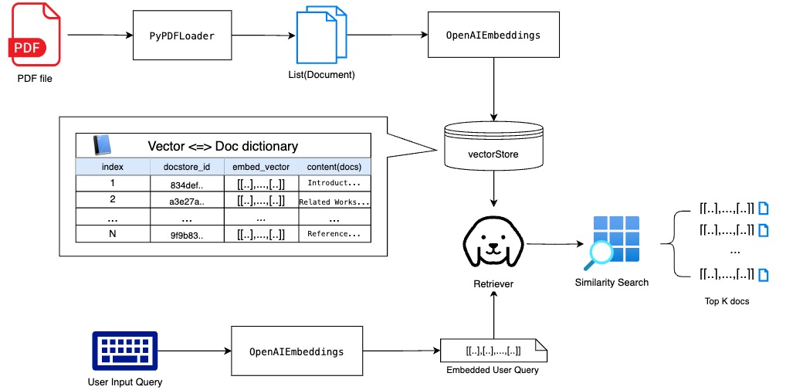
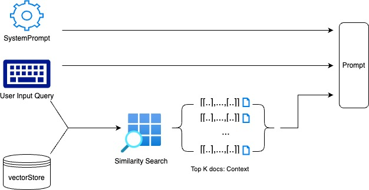

이번 프로젝트는 RAG(Retrieval-Augmented Generation)를 사용하는 실습으로 유저가 PDF를 업로드하고 모델이 PDF 파일의 내용을 숙지하게 만든 뒤 유저의 자연어 질문에 대해 PDF 내용을 근거로 답변해주는 챗봇을 만들어 보는 것이다.

이를 위해 우리가 필요한 컴포넌트들은 다음과 같다.

- PDF 로더: 유저가 업로드하는 PDF를 읽어와 필요하다면 부분으로 나눈 뒤 각 부분들을 모델이 알아들을 수 있는 타입으로 변환하는 단계
- 벡터 스토어: 임베딩 벡터로 변환 & 벡터 스토어에 저장 => 임베딩 모델, 벡터 스토어 적용
- Semantic search & Document 반환이 가능한 컴포넌트: 유저의 질문을 입력받아 의미적으로 유사하고 적절한 Document를 반환하는 단계 => 사용자 질문을 벡터로 바꿔주는 임베딩 모델과 바뀐 임베딩 벡터와 유사한 Document들을 찾아주는 리트리버 적용
- 답변 생성기: 반환된 Document들을 context로 질문에 대한 적절한 답변 생성할 수 있는 모델 => 프롬프트 구성 & LM 적용


이번 포스트에선 앞선 세 단계에 대한 전반적인 개념 위주로 설명할 것이며 다룰 내용은 다음과 같다.



1. LangChain의 Document Loader에 대해 알아본 후 PDF loader로 pdf 자료의 텍스트 데이터를 Document 형식으로 가져오는 방법을 알아본 후
2. 구성된 Document들을 임베딩 벡터로 변환하여 VectorStore에 저장하고 사용자의 질문에 대해 적절한 Document들을 반환하는 것까지 알아볼 예정이다.

---


# Step1.  LangChain의 Document Loader

우선 Langchain에서 제공하는 기본 Document 클래스의 구조에 대해 간단히 살펴본 후 다양한 포맷의 인풋 데이터들을 이 Document 형태로 변환해주는 Document loader에 대해 알아보자.

## Document Class

Document class는 `langchain_core.documents`에 위치한 클래스로 랭체인에서 다루는 문서(documents)에 대한 가장 기본적인 클래스이다. 이 문서는 당연하게도 텍스트들의 집합이며 그냥 텍스트만 있는 것이 아닌 메타 데이터를 같이 들고 있을 수 있다. 따라서 이 클래스는 크게 두가지 부분으로 나눠져있다.
- metadata(optional): dict 데이터 타입으로 한 페이지에 대한 메타 데이터를 담고 있다. 예를 들면 출처, 문서 내 페이지 넘버, 다른 문서들과의 관계 등이다.
- page_content: str 타입으로 문서가 담고 있는 컨텐츠 자체이다.

예를 들면 어느 한 논문을 가져와 Document들로 구성한다고 하면 다음과 같은 꼴이 될 것이다.


| document_id | page_id | content_type  | text                                                               |
|-------------|---------|---------------|--------------------------------------------------------------------|
|     doc1    | 1       | ABSTRACT      | This paper presents a new framework to..                           |
|     doc2    | 1       | INTRODUCTION  | A floor plan is a drawing that describes..                         |
|     doc3    | 2       | RELATED_WORKS | Detecting and classifying floor-plan basic elements..              |
| ...         | ...     | ...           | ...                                                                |
|    doc100   | 17      | REFERENCES    | Kingma, D.P.; Ba, J. Adam: A method for stochastic optimization... |


이 테이블에서  `document_id`, `page_id`, `content_type`필드들은 metadata에 들어갈 것이며 `text`필드는 page_content가 될 것이다.

따라서 document의 metadata와 page_content는 다음과 같은 꼴로 나타낼 수 있다.
```py
doc.metadata = {
    "document_id": "doc1",
    "page_id": 1,
    "content_type": "ABSTRACT"
}

doc.page_content = "This paper presents a new framework to classify floor plan elements and represent them in a vector format. Unlike existing approaches using image-based learning frameworks as the first step to segment the image pixels, we first convert the input floor plan image into vector data and utilize a graph neural network. Our framework consists of three steps."
```


## DocumentLoader

그렇다면 위의 Document를 생성해보자. LangChain의 구성 라이브러리 중 하나인 langchain_community엔 `document_loaders`란 폴더가 있다. 여기엔 여러 가지 형태의 Document Loader들이 정의 돼있으며 문서의 타입이나 포맷에 따라 거기에 맞는 미리 구성된 loader들을 사용하면 된다. 

모든 loader들은 `BaseLoader`라는 클래스를 상속받아 구현돼있다. `BaseLoader`([🔗](https://github.com/langchain-ai/langchain/blob/master/libs/core/langchain_core/document_loaders/base.py))는 `load()`라는 메서드로 document를 가져와 `List[Document]`형태로 반환한다. 
  - `load_and_split` 메서드는 `RecursiveCharacterTextSplitter`를 사용해 load한 긴 문서를 여러 개의 chunk들로 나눠 반환한다(근데 deprecate될 예정이니 override하지 말라고 써있다). chunk에 대해선 아래에서 더 자세히 설명할 예정이다.

자 그럼 우선 가장 기본적인 TextLoader를 사용해서 예시로 사용될 논문의 초록 txt 파일을 가져와보자.
파일 경로를 인자로 `TextLoader` 객체를 하나 만들고 `load()`로 `Document` 리스트를 반환한다.


```python
from langchain_community.document_loaders import TextLoader

file_path = base_dir + "/data/document_loaders/abstract.txt"

text_loader = TextLoader(
    file_path=file_path
)

docs = text_loader.load()

print(f"▶︎ No. of Documents: {len(docs)} \n\n▶︎ Content: \n{docs[0].page_content}")
```

    ▶︎ No. of Documents: 1 
    
    ▶︎ Content: 
    Abstract
    This paper presents a new framework to classify floor plan elements and represent them in a vector format. Unlike existing approaches using image-based learning frameworks as the first step to segment the image pixels, we first convert the input floor plan image into vector data and utilize a graph neural network. Our framework consists of three steps. (1) image pre-processing ...


위 결과를 보면 문서 분할을 적용하지 않아 단 하나의 document에 모든 내용이 담겨져 있다. load_and_split을 적용해보면 아래와 같이 `RecursiveCharacterTextSplitter`가 적당한 길이로 텍스트를 나눠 따로 `Document`에 저장후 `Document` list를 반환한다.


```python
docs = text_loader.load_and_split()
print(f"▶︎ No. of Documents: {len(docs)} \n\n▶︎ Contents")
for idx, doc in enumerate(docs):
    print(f"▶︎ Doc {str(idx)}: {doc.page_content}\n")

```

    ▶︎ No. of Documents: 2 
    
    ▶︎ Contents
    ▶︎ Doc 0: Abstract
    This paper presents a new framework to classify floor plan elements and represent them in a vector format. Unlike existing approaches using image-based learning frameworks as the first step to segment the image pixels, we first convert the input floor plan image into vector data and utilize a graph neural network. Our framework consists of three steps. (1) image pre-processing and vectorization of the floor plan image; (2) region adjacency graph conversion; and (3) the graph neural network on converted floor plan graphs. Our approach is able to capture different types of indoor elements including basic elements, such as walls, doors, and symbols, as well as spatial elements, ...
    
    ▶︎ Doc 1: In this paper, we propose a framework that finds any kind of element in the floor plan without losing the shape information. It first vectorizes the input floor plan image as it is to maintain the shape of the original indoor elements and minimize the abstraction. The polygon vector set is then converted into a region adjacency graph. The graph is then fed to an inductive learning-based graph neural network (GNN), which is used to compare multiple floor plan graphs and perform node classification by analyzing inherent features and the relationships between the nodes. This allows the user to classify basic indoor elements (e.g., walls, windows, doors, etc.) and symbols, together with ...


## PDF파일 Loader

앞서 말했듯이 document_loaders 에는 BaseLoader를 상속받아 구현된 다양한 문서의 타입이나 포맷에 따른 loader들이 구현돼있다. 그 중 PDF 파일에 대한 loader도 여러 가지 있다. `PyPDFLoader`는 pypdf를 사용해 PDF 파일을 `Document` 리스트로 바꿔준다. 페이지 단위로 chunk로 바꿔주며 페이지 숫자를 metadata로 넣어준다고 한다.

>  이 loader를 사용하기 위해선 미리 pypdf 라이브러리를 설치해야 한다.

아래와 같이 코드를 실행해보면 잘 나오고 있으며 페이지 숫자가 `metadata['page']`에 들어있다는 것을 확인할 수 있다.


```python
from langchain_community.document_loaders import PyPDFLoader

pdf_loader = PyPDFLoader(
    file_path = data_dir + "/document_loaders/paper.pdf",
    extract_images = False
)

docs = pdf_loader.load()

print(f"▶︎ No. of Documents: {len(docs)} \n\n▶︎ Contents")
for idx, doc in enumerate(docs):
    print(f"▶︎ Doc {str(idx)}: {doc.page_content[:100]}...\n※ Metadata: page = {doc.metadata["page"]}\n")
```

```tex
▶︎ No. of Documents: 17 

▶︎ Contents
▶︎ Doc 0:  International Journal of
Geo-Information
Article
Framework for Indoor Elements Classification via In...
※ Metadata: page = 0

▶︎ Doc 1: ISPRS Int. J. Geo-Inf. 2021 ,10, 97 2 of 17
models may be essential for specific user purposes, such ...
※ Metadata: page = 1

▶︎ Doc 2: ISPRS Int. J. Geo-Inf. 2021 ,10, 97 3 of 17
objects, respectively, in floor plans with various drawin...
※ Metadata: page = 2

▶︎ Doc 3: ISPRS Int. J. Geo-Inf. 2021 ,10, 97 4 of 17
pixel line. Then, the floor plan graph is fed into a GNN ...
※ Metadata: page = 3

...

▶︎ Doc 16: ISPRS Int. J. Geo-Inf. 2021 ,10, 97 17 of 17
19. Hu, R.; Huang, Z.; Tang, Y.; van Kaick, O.; Zhang, ...
※ Metadata: page = 16
```

한편  `PyPDFLoader`는 단순 전체 파일을 페이지 기반으로 나누며 메타 데이터도 `page`라는 이름의 페이지 숫자만 제공했던 것과 달리 `PyMuPDFLoader`는 PyMuPDF 라이브러리를 사용하며 메타 데이터 추출에 더욱 강점이 있다고 한다.

```python
from langchain_community.document_loaders import PyMuPDFLoader
        
pdf_loader = PyMuPDFLoader(
    file_path = os.path.join(data_dir + "/document_loaders/paper.pdf"),
    extract_images = False
)

docs = pdf_loader.load()

check_docs(docs, show_len=100, meta_show_only_keys = True)
```

```
▶︎ No. of Documents: 17 

▶︎ Contents
* Doc 0:  
International Journal of
Geo-Information
Article
Framework for Indoor Elements Classification via I...
※ Metadata: ['source', 'file_path', 'page', 'total_pages', 'format', 'title', 'author', 'subject', 'keywords', 'creator', 'producer', 'creationDate', 'modDate', 'trapped']

* Doc 1: ISPRS Int. J. Geo-Inf. 2021, 10, 97
2 of 17
models may be essential for specific user purposes, such ...
※ Metadata: ['source', 'file_path', 'page', 'total_pages', 'format', 'title', 'author', 'subject', 'keywords', 'creator', 'producer', 'creationDate', 'modDate', 'trapped']

* Doc 2: ISPRS Int. J. Geo-Inf. 2021, 10, 97
3 of 17
objects, respectively, in floor plans with various drawin...
※ Metadata: ['source', 'file_path', 'page', 'total_pages', 'format', 'title', 'author', 'subject', 'keywords', 'creator', 'producer', 'creationDate', 'modDate', 'trapped']

* Doc 3: ISPRS Int. J. Geo-Inf. 2021, 10, 97
4 of 17
pixel line. Then, the floor plan graph is fed into a GNN ...
※ Metadata: ['source', 'file_path', 'page', 'total_pages', 'format', 'title', 'author', 'subject', 'keywords', 'creator', 'producer', 'creationDate', 'modDate', 'trapped']

* Doc 4: ISPRS Int. J. Geo-Inf. 2021, 10, 97
5 of 17
The detailed process is described as follows. A closed a...
※ Metadata: ['source', 'file_path', 'page', 'total_pages', 'format', 'title', 'author', 'subject', 'keywords', 'creator', 'producer', 'creationDate', 'modDate', 'trapped']

...

* Doc 16: ISPRS Int. J. Geo-Inf. 2021, 10, 97
17 of 17
19.
Hu, R.; Huang, Z.; Tang, Y.; van Kaick, O.; Zhang, ...
※ Metadata: ['source', 'file_path', 'page', 'total_pages', 'format', 'title', 'author', 'subject', 'keywords', 'creator', 'producer', 'creationDate', 'modDate', 'trapped']
```

위 메타 데이터를 보면 subject 필드에 논문의 제목인 `title`과 초록(abstract)인 `subject`라는 필드를 가지고 있다. 이 정보는 문서의 메인 아이디어와 정체성, 요약본을 나타내기에 중요한 정보이므로 RAG 시스템을 구성하는데 유용하게 사용할 수 있다.


```python
paper_metadata = f"""
Paper Title: {docs[0].metadata['title']}
Paper Abstract : {docs[0].metadata['subject']}
      """

print(paper_metadata)
```


    Paper Title: Framework for Indoor Elements Classification via Inductive Learning on Floor Plan Graphs
    Paper Abstract : This paper presents a new framework to classify floor plan elements and represent them in a vector format. Unlike existing approaches using image-based learning frameworks as the first step to segment the image pixels, we first convert the input floor plan image into vector data and utilize a graph neural network. Our framework consists of three steps. (1) image pre-processing and vectorization of the floor plan image; (2) region adjacency graph conversion; and (3) the graph neural network on converted floor plan graphs. Our approach is able to capture different types of indoor elements including basic elements, such as walls, doors, and symbols, as well as spatial elements, such as rooms and corridors. In addition, the proposed method can also detect element shapes. Experimental results show that our framework can classify indoor elements with an F1 score of 95%, with scale and rotation invariance. Furthermore, we propose a new graph neural network model that takes the distance between nodes into account, which is a valuable feature of spatial network data.


​    

---

  

  

# Step 2. Vectore Store를 사용해 Document 데이터 => 벡터 데이터로 임베딩 하여 저장하기
우리는 API를 통해 LLM 모델을 가져와 활용하고 있으나 우리가 가지고 있는 데이터에 대해선 LLM 모델은 알지 못한다. 우리가 가진 데이터를 기반으로 LM 모델에게서 원하는 답을 얻기 위해선 데이터를 학습 시키거나 프롬프트에서 알려줘야하는데 학습, 즉 우리의 데이터로 모델을 파인튜닝하기엔 현실적으로 불가능한 경우가 많다.

따라서 우리가 가진 커스텀 데이터를 프롬프트에 넣어 그 데이터들을 기반으로 LM이 적절한 답변을 생성해줘야 하며 이 과정을 흔히 RAG(Retrieval Augmented Generation)라고 한다.

커스텀 데이터를 프롬프트에 넣는 가장 간단한 방법은 (텍스트 데이터만 있을 경우) 그냥 스트링의 형태로 넣어주는 것이지만 LLM 모델 API에는 보통 입력 크기의 제한이 있다. 게다가 논문과 같은 PDF가 담고 있는 텍스트의 양은 매우 많기 때문에 그걸 모두 텍스트로 넣어주면 입력 크기 제한에 걸리지 않더라도 LM이 읽다가 끝에 가선 중간 내용을 잊고만다.

이를 해결하기 위해 우리는 질문에 대한 가장 유사성이 높은 Documents만 뽑은 뒤 그 내용을 프롬프트에 Context로 넣어주고 LM은 사용자 질문, 시스템 프롬프트, 그리고 이 맥락을 기반으로 답변을 생성할 수 있다.




## 벡터 스토어 생성 & 문서 임베딩

Vector Store는 말 vector들을 담고 있는 저장소로 벡터 데이터 저장과 동반해 여러 관련 기능들을 포함한 클래스이다.


```python
from langchain_openai import OpenAIEmbeddings
from langchain_core.vectorstores import VectorStore #Vector Store들의 베이스 클래스
from langchain_core.documents import Document
from typing import List
from langchain_community.vectorstores import chroma, faiss

open_ai_embedding_model = OpenAIEmbeddings()

def get_vector_store(vector_store_model:VectorStore, documents:List[Document], embedding_model):
    return vector_store_model.from_documents(embedding = embedding_model, documents = documents)

# Chroma
vector_store_chroma = get_vector_store(
    vector_store_model = chroma.Chroma, 
    documents = docs, 
    embedding_model = open_ai_embedding_model
)

# FAISS
vector_store_faiss = get_vector_store(
    vector_store_model = faiss.FAISS, 
    documents = docs, 
    embedding_model = open_ai_embedding_model
)
```

위 코드를 통해 저장된 문서를 직접 어떤 모습인지 살펴보면 다음과 같다. 

- FAISS의 경우 실제 문서들은 다음 구조로 저장돼있다.
  `index(int) <=> docstore_id(str) <=> document_value(documents.base.Document)`

현재 생성한 `vector_store_faiss`의 경우 `pdf_loader`로 생성한 총 17개의 문서들(docs)이 들어가 있고 0~16번의 index와 맵핑되는 `docstore_id`들과 그것을 키로 가지고 있는 실제 `Document` 인스턴스들이 있다.

샘플로 index: 11 문서를 보면 아래와 같다.

```python
idx_docstore_id = vector_store_faiss.index_to_docstore_id
sample_doc_store_id = idx_docstore_id[11]
doc = vector_store_faiss.docstore.search(sample_doc_store_id)

print(f"""
- index: {11}
- docstore_id: {sample_doc_store_id}
- doc_metadata: {doc.metadata}
- page_content: {doc.page_content[:200]}, ...
""")
```


    - index: 11
    - docstore_id: 83def28e-b433-46f8-85d5-a7343309ccc2
    - doc_metadata: {'source': '/Users/lymansong/Documents/GitHub/study/langchain_tutorial/data/document_loaders/paper.pdf', 'page': 11}
    - page_content: ISPRS Int. J. Geo-Inf. 2021 ,10, 97 12 of 17
    easily find the dominant features on unseen data, such as predicting whether it is spatial or
    non-spatial by looking at the area attribute.
    Table 1. Class-w, ...


## 벡터 스토어에서 검색하기

벡터스토어를 만든 주 이유는 단순히 문서들을 저장하기 위함이 아니고 검색하기 좋게 저장하기 위해서이다. 

검색하기 좋게 하기 위해 자연어를 임베딩벡터로 바꿔준 것이며 우리가 입력한 검색어 역시 임베딩 벡터로 바꾼 뒤 검색 임베딩과 벡터 스토어 내 저장된 임베딩 벡터들 사이의 유사도를 계산, 가장 유사도가 높게 나온 벡터들과 그 벡터들의 원래 자연어의 모습을 반환해주는 것이 벡터 스토어의 주 기능이다.

그럼 위에서 만든 벡터스토어를 사용해 유저가 던진 샘플 질문과 가장 유사한 내용을 가진 문서를 반환해보자. 여기서 중요한 것은 **유사성 검사를 위해 유저가 던진 질문을 임베딩 벡터로 만들기 위해 임베딩 모델에 넣을 때 벡터 스토어를 만들 때 사용한 임베딩 모델과 동일한 모델을 사용해야한다는 점이다.** 


```python
import numpy as np

# 검색 대상 샘플 질문 생성
user_input_query = 'What is the title of the paper?'
user_input_q_vector = np.array([open_ai_embedding_model.embed_query(user_input_query)], dtype=np.float32)

# 샘플 쿼리로 가장 가까운 문서를 검색 후 반환(k=1)
result = vector_store_faiss.index.search(x = user_input_q_vector, k = 1)

print(result) #(score, index)

## 반환된 결과의 index 값으로 docstore_id를 찾고 docstore_id로 doc 찾기
doc = vector_store_faiss.docstore.search(vector_store_faiss.index_to_docstore_id[result[1][0][0]])

print(f"""
Result >>
- index: {result[1][0][0]}
- score(distance): {result[0][0][0]}
- docstore_id: {vector_store_faiss.index_to_docstore_id[result[1][0][0]]}
- page_content: {doc.page_content[:200]}, ...
      """)
```

    (array([[0.5138505]], dtype=float32), array([[16]]))
    
    Result >>
    - index: 16
    - score(distance): 0.5138505101203918
    - docstore_id: ca3b4a73-eb04-49c3-8abb-08bc06fdd78a
    - page_content: ISPRS Int. J. Geo-Inf. 2021 ,10, 97 17 of 17
    19. Hu, R.; Huang, Z.; Tang, Y.; van Kaick, O.; Zhang, H.; Huang, H. Graph2Plan: Learning Floorplan Generation from Layout
    Graphs. arXiv 2020 , arXiv:2004., ...


결과는 17번째 문서가 반환 됐으며 스코어는 정규화된 두 벡터 사이의 거리로 약 0.514가 나왔다. 

이번엔 여러 문서를 뽑아보자(k = 3). 질문 벡터에 대한 반환되는 각 벡터들과의 거리들을 `1 - x/sqrt(2)`로 유사도를 계산해 같이 넣어줬다

> OpenAI는 벡터를 반환할 때 unit normed, 즉 벡터의 크기를 정규화해 최대 1(단위벡터)로 변환해 반환한다. 위 식은 반환된 정규화된 유클리드 거리에 대한 유사성을 다시 한번 % 단위로 정규화 해주는 함수로 정규화된 벡터 사이의 거리는 0이 가장 가까운 것, sqrt(2)가 가장 먼 것이기에 이 범위 내에서 유사도로 변환해주는 것이다.


```python
import math 

def print_retrieved_doc(rank, idx, score, vs, doc):
    return f"""
- K: {rank}
- index: {idx}
- similiarity: {round(score*100, 1)}%
- docstore_id: {vs.index_to_docstore_id[idx]}
- page_content: {doc.page_content[:200]}, ...
"""

def get_doc(idx, vs = vector_store_faiss):
    return vs.docstore.search(vs.index_to_docstore_id[idx])

get_relevance = lambda x: 1.0 - x / math.sqrt(2)

user_input_query = 'How to make a Region Adjacency Graph?'
user_input_q_vector = np.array([open_ai_embedding_model.embed_query(user_input_query)], dtype=np.float32)

results = vector_store_faiss.index.search(x = user_input_q_vector, k = 3)
print(results) #(score, index)

scores, doc_ids = results[0][0], results[1][0]

for doc_rank, (s, idx, doc) in enumerate(zip(map(get_relevance, scores), doc_ids, map(get_doc, doc_ids))):
    print(print_retrieved_doc(doc_rank, idx, s, vector_store_faiss, doc))

```

    (array([[0.37418255, 0.40982437, 0.4281325 ]], dtype=float32), array([[4, 5, 3]]))
    
    - K: 0
    - index: 4
    - similiarity: 73.5%
    - docstore_id: c4c6f979-8c38-49db-9972-aa89e966b0f8
    - page_content: ISPRS Int. J. Geo-Inf. 2021 ,10, 97 5 of 17
    The detailed process is described as follows. A closed area surrounded by black pixels
    in the image becomes a polygon object. Likewise, a set of polygons is, ...
    
    - K: 1
    - index: 5
    - similiarity: 71.0%
    - docstore_id: 8a49da4b-0df8-46d3-8f30-0777d286a74f
    - page_content: ISPRS Int. J. Geo-Inf. 2021 ,10, 97 6 of 17
    Algorithm 1: RAG conversion
    input : A polygon set P, a minimum area parameter m
    output : A floor plan graph G
    // Create a graph with adding polygon nodes
    1G←, ...
    
    - K: 2
    - index: 3
    - similiarity: 69.7%
    - docstore_id: ad172925-4675-4901-8df2-9537ddc0c427
    - page_content: ISPRS Int. J. Geo-Inf. 2021 ,10, 97 4 of 17
    pixel line. Then, the floor plan graph is fed into a GNN model as the input graph and a
    graph is obtained where the nodes were classified according to their l, ...


다음 포스트에선 이번 내용에 이어서 LM 모델을 사용해 문서를 정제한 뒤 Text spliter 방법을 사용해 `Document` 텍스트를 적절한 크기의 청크로 분리해서 벡터 스토어에 넣는 방법을 알아볼 예정이다


> 참고 문서 및 링크

- 예제 논문 데이터: Song J, Yu K. Framework for Indoor Elements Classification via Inductive Learning on Floor Plan Graphs. *ISPRS International Journal of Geo-Information*. 2021; 10(2):97. [[🔗](Song J, Yu K. Framework for Indoor Elements Classification via Inductive Learning on Floor Plan Graphs. *ISPRS International Journal of Geo-Information*. 2021; 10(2):97. https://doi.org/10.3390/ijgi10020097)]
- LangChain API Reference [[🔗](https://api.python.langchain.com/en/latest/langchain_api_reference.html)]
- LangChain Docs > Components > Retrieval [[🔗](https://python.langchain.com/docs/modules/data_connection/)]
