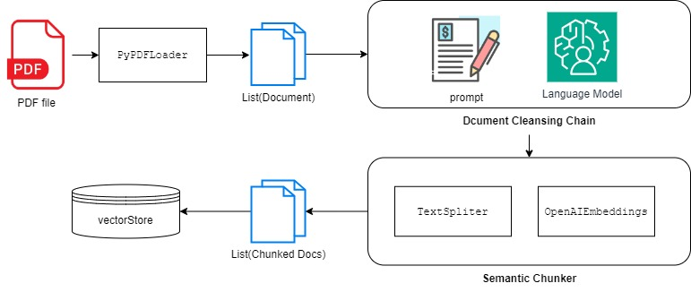

```
layout: single
title:  "RAG 실습 2. PDF파일과 대화하기(중: 언어모델을 사용한 Document 정제, 의미적으로 Chunking하기)"
classes: wide
categories: LangChain
tags: [LangChain, RAG]
```

[이전 포스트](https://lymanstudio.github.io/langchain/rag_1_loader_vectorstore/)에서 우리는 Document Loading부터 벡터 스토어 구성까지 전반적인 과정을 각 단계별 튜닝 없이 빠르게 훑어보았다. 하지만 중간에 문서를 정제하지도 않아 문서에 있는 텍스트를 그대로 사용했으며 한 페이지의 전체 내용이 하나의  Document에 들어가 차후 문서들을 검색에 사용하기에 용이하지도 않은 상태이다.


이번 포스트에선 위의 내용들을 집중적으로 다뤄볼 것이다. 

* 우선 첫번째로 load된 Document들을 정제하는 과정을 살펴보고 다시  Document로 구성한다. 이과정에서 간단한 LM을 사용할 것이다.

* 두번째로 정제된 Document들을 TextSpliter를 사용해 작은 chunk로 쪼개어줄 것이다. 이 과정에서 각 문장 사이의 유사도를 구해 그것을 기반으로 문장들의 부분 집합으로 나누어 줄 예정이다.

오늘 다뤄볼 과정은 다음과 같다.



---


# Step 3. 언어 모델을 활용한 문서 정제

문서를 벡터 DB에 저장하기 전에 우선 load된 문서의 본문을 정리할 필요가 있다. 우리가 예제로 쓰는 논문을 자세히 분해해보면 다른 텍스트로 된 간결한 문서들과 다른 여러 가지 특징이 있다. 
1. 모든 페이지 상/하단에 저널 정보, 페이지 번호가 있다.
2. 중간에 도표나 그림이 있을 경우 설명 캡션이 따라 붙는다.
3. References, 즉 참고 문헌들은 여러 citation스타일로 문자들이 단순히 나열돼있으며 그 자체만으로 큰 의미를 가지기 힘들다.
4. 초록은 논문의 전체 내용을 요약하는 아주 중요한 문단이다.

위 특징들을 참고 하여 논문의 내용들을 가다듬을 필요가 있다. 특히 저널명과 개제된 호수 등의 반복되는 정보는 큰 의미가 없으나 이후 진행될 textsplit 단계에서 명시적으로 무시하긴 힘드므로 필수적으로 제거돼야 한다.

하지만 명시적은 rule-based 제거 방법은 없으므로 LLM의 힘을 빌려 문서 cleansing을 진행한다.

문서 cleansing을 진행하기 위해 우선 프롬프트를 작성해야 한다.
모델에게 논문 전문 편집자라는 role을 주고 위에서 나열한 특징을 감안해서 자세하게 모든 내용을 담은 편집본을 달라고 말한다.
또한 페이지가 나눠져 있으므로 앞선 페이지의 결과를 다음 페이지의 생성에 참고하도록 구성했다.

완성한 프롬프트는 다음과 같다.


```python
from langchain.prompts import PromptTemplate

template = """
You are an editor who is expert on editing thesis papers into a rich and redundant-erased writings. Your job is to edit PAPER.
If the client gives you PAPER(a part of thesis paper) with PRV_PAGE(the summary of the previous page).
To make a edited version of PAPER, you have to keep the following rules.
1. Erase all the additional information that are not directly related to the idea and content of the paper, such as the name of journal, page numbers, so on.
In most case, those additional information is located in the first or the last part of PAPER. 
2. Erase all the reference/citation marks of numbers in the middle of PAPER.
3. Edit PAPER in a rich manner and should contains all the idea and content. Do not discard any content. 
4. It has to be related and successive to the content of PRV_PAGE. But should not repeatedly have the PRV_PAGE content.
5. Note that there are successive pages waiting to be edited, so the result should not be ended with the feeling that it is the last document.
6. Do not conclude at the end the current editing, unless PAPER only contains references(imply that current PAPER is the end of the thesis). 

## PRV_PAGE: {prv_page}

## PAPER: {content} 
"""
```

다음으로 간단하게 LCEL 구문으로 문서 cleansing chain을 구성했다. LLM모델은 gpt-3.5-turbo를 사용했다.


```python
prompt = PromptTemplate.from_template(template)

from langchain_openai import ChatOpenAI
from langchain_core.output_parsers import StrOutputParser

model = ChatOpenAI(model='gpt-3.5-turbo')
cleansing_chain = prompt | model | StrOutputParser()
```

샘플로 첫번째 페이지를 위 모델에 적용해 결과를 살표보자. 첫번째 페이지이므로 `PRV_PAGE`는 빈 스트링을 넣어준다.


```python
prv_page = """
"""
result = cleansing_chain.invoke({
    "prv_page" : prv_page,
    "content" : docs[0].page_content
})

print(result)
```

    The paper introduces a novel framework for classifying indoor elements and representing them in a vector format. Unlike traditional methods that use image-based learning to segment pixels, this framework converts the floor plan image into vector data and utilizes a graph neural network. The three-step process includes image pre-processing and vectorization, region adjacency graph conversion, and applying the graph neural network on the converted floor plan graphs.
    
    This approach is capable of identifying various indoor elements, including walls, doors, symbols, rooms, corridors, and even element shapes. Experimental results demonstrate that the framework achieves a 95% F1 score with scale and rotation invariance. Additionally, a new graph neural network model is proposed that considers the distance between nodes, a crucial aspect of spatial network data.
    
    Floor plans are essential drawings that depict the layout of a specific level in a building or structure, containing structural elements like walls, windows, doors, and spatial elements such as rooms and corridors. Digitizing floor plans poses challenges as they are primarily images without explicit object information. Therefore, feature extraction and analysis of indoor spatial data from floor plan images require pre-processing and analytical algorithms. While heuristic algorithms yield high accuracy, they are limited to specific drawing styles, prompting the adoption of machine learning-based approaches.
    
    Convolutional Neural Network-based methods have gained popularity due to their applicability to various floor plan styles, minimal pre-processing requirements, and robustness to noise. However, these methods struggle to capture the exact shape of indoor elements, necessitating additional post-processing steps to abstract neural network outputs. Despite this, abstracting the floor plan layout through machine learning may result in a loss of original element features, such as the representation of walls as line vectors instead of polygons.
    
    In conclusion, the proposed framework offers a promising solution for indoor element classification and representation in vector format, showcasing high accuracy and versatility in capturing diverse types of indoor elements. The integration of a graph neural network model that considers node distances enhances the analysis of spatial network data, presenting a valuable contribution to floor plan analysis and spatial data processing.


```python
prv_page = result
result = cleansing_chain.invoke({
    "prv_page" : prv_page,
    "content" : docs[1].page_content
})

print(result)
```

    In this study, we present a novel framework for identifying indoor elements within floor plans while preserving their original shape information. The framework involves a three-step process: first, the input floor plan image is vectorized to maintain the shape of indoor elements and minimize abstraction. Next, the polygon vector set is converted into a region adjacency graph, which is then input into a graph neural network (GNN) for node classification. The GNN analyzes inherent features and relationships between nodes to classify basic indoor elements (e.g., walls, windows, doors) and symbols, as well as spatial elements (e.g., rooms, corridors). This approach ensures that the shape and aerial features of elements are retained throughout the classification process.
    
    Furthermore, we introduce a new GNN model called the Distance-Weighted Graph Neural Network (DWGNN). This model considers the distance information between nodes, expressed through edge features in the spatial network. By assigning attention values to neighboring nodes based on their proximity to a target node, the DWGNN enhances the analysis of spatial network data. We evaluate the performance and expressiveness of this framework by applying it to two floor plan datasets and one data-augmented dataset.
    
    The following sections of the paper discuss the limitations of previous research on floor plan analysis, particularly in indoor element classification using rule-based methods and machine learning approaches. We then propose our framework for floor plan element classification via GNN, highlighting its advantages over traditional heuristic methods and its ability to maintain the shapes of elements across different drawing styles. Finally, we present the results of our analysis on three datasets and discuss potential issues and areas for further research. Our framework offers a promising solution for accurately classifying indoor elements in vector format, showcasing high accuracy and versatility in capturing diverse types of indoor elements.


결과가 만족 스러우니 전체 페이지에 대해 이 과정을 진행하고 이를 통해 새로운 Document를 만들어준다.


```python
from langchain_core.documents import Document
from time import time

start = time()
result_docs = []
result_concat = ""
prv_page = ""
for i, doc in enumerate(docs):
    result = cleansing_chain.invoke({
        "prv_page" : prv_page,
        "content" : doc.page_content
    })

    result_docs.append(Document(page_content = result, paper_metadata = doc.metadata))
    result_concat += ("\n" + result)
    prv_page = result
    print(f"{i+ 1} 번째 문서 완료({i + 1}/{len(docs)})")    

print(f"elapsed time : {time() - start} seconds")
```

    1 번째 문서 완료(1/17)
    2 번째 문서 완료(2/17)
    3 번째 문서 완료(3/17)
    4 번째 문서 완료(4/17)
    5 번째 문서 완료(5/17)
    6 번째 문서 완료(6/17)
    7 번째 문서 완료(7/17)
    8 번째 문서 완료(8/17)
    9 번째 문서 완료(9/17)
    10 번째 문서 완료(10/17)
    11 번째 문서 완료(11/17)
    12 번째 문서 완료(12/17)
    13 번째 문서 완료(13/17)
    14 번째 문서 완료(14/17)
    15 번째 문서 완료(15/17)
    16 번째 문서 완료(16/17)
    17 번째 문서 완료(17/17)
    elapsed time : 110.78608131408691 seconds


# Step 4. TextSpliter를 사용해 문서 Chunking 하기

TextSpliter 클래스는 이름의 의미 그대로 텍스트를 분할해주는 클래스이다. 기본적으로 LM 이 언어모델이기에 입력이 문자열인 경우가 많고 입력으로 주는 데이터를 목적에 맞게 잘 나눠주는 것이 필요하다.
우리는 앞서 PDF파일을 가져올 때 문서 페이지 단위로 잘라 Document 객체를 생성했지만 이런 경우 사용자가 원하는 기능과 유사한 문서를 가져올 때 상당히 많은 수의 텍스트를 담고 있는 Document들이 반환될 것이기에 입력 길이가 길어질 수 밖에 없으며 무엇보다 사용자가 원하는 내용과 상관 없는 불필요한 내용들을 가지고 있을 확률도 높다.

우리가 원하는 이상적인 Document는 
1. 사용자가 질문/요구하는 내용과 의미론적으로 유사한 내용은 최대한 가지고 있어야 하고
2. 그외의 부가적이거나 관련 없는 내용은 최대한 가지고 있지 않아야 하며
3. 그 수가 너무 많지 않아야 한다(모델 입력 크기의 제한이 있거나 토큰 수가 많아지면 그만큼 비용/컴퓨팅 리소스 사용 면에서 비효율적이기에).

따라서 우리는 TextSpliter를 사용해 우리의 텍스트 자료를 위의 세가지 기준을 만족하는 Document로 분할해야 한다.


## 기본적인 spliter

우선 기본적인 분할부터 알아보자. `CharacterTextSplitter`는 설정한 seperator를 기준으로 텍스트를 분할한다. seperator의 기본값은 `\n\n`, 즉 line break로 문단을 나누는 것으로 분할한다는 의미로 추정된다. 이 기준으로 우리가 가진 Document 중 3번째 객체, 즉 3번째 페이지를 분할해보자/

`CharacterTextSplitter`객체를 만들 때 다음과 같은 인자를 넣어 세팅해주어야 한다.(출처: 테디노트, [<랭체인 노트>](https://code.visualstudio.com/docs/editor/codebasics) )
* separator 매개변수로 분할할 기준을 설정합니다. 기본 값은 "\n\n" 입니다.
* chunk_size 매개변수를 250 으로 설정하여 각 청크의 최대 크기를 250자로 제한합니다.
* chunk_overlap 매개변수를 50으로 설정하여 인접한 청크 간에 50자의 중복을 허용합니다.
* length_function 매개변수를 len으로 설정하여 텍스트의 길이를 계산하는 함수를 지정합니다.
* is_separator_regex 매개변수를 False로 설정하여 separator를 정규식이 아닌 일반 문자열로 처리합니다.


```python
from langchain.text_splitter import CharacterTextSplitter 

target_doc = docs[1] ## 대상 문서 확인
print("● Target Documnet Content\n")
print(target_doc.page_content)

spliter = CharacterTextSplitter(
    # separator="\n\n",
    chunk_size = 50,
    chunk_overlap = 20,
    length_function = len,
    is_separator_regex=False,
)

result_docs = spliter.create_documents(
    texts = [target_doc.page_content],
    metadatas= [target_doc.metadata],
)
print("\n\n● Result:\n")
check_docs(result_docs)
```


    ● Target Documnet Content
    
    In this study, we present a novel framework for indoor element classification and representation in vector format. Unlike traditional methods that rely on image-based learning frameworks for pixel segmentation, our approach converts floor plan images into vector data and utilizes a graph neural network for analysis. The framework consists of three main steps: image pre-processing and vectorization, conversion to a region adjacency graph, and application of the graph neural network for indoor element classification.
    
    Our method accurately classifies indoor elements such as walls, doors, symbols, rooms, and corridors, while also detecting element shapes with a high F1 score of 95%. We also introduce a new graph neural network model that considers the distance between nodes, which is crucial for spatial network data analysis.
    
    The proposed framework aims to address the limitations of existing methods by preserving the original shapes of indoor elements during classification. By leveraging a graph neural network, we can classify basic indoor elements and symbols, along with space elements, without losing their shape and spatial characteristics.
    
    Furthermore, we introduce the Distance-Weighted Graph Neural Network (DWGNN), which assigns attention values to neighboring nodes based on their distance from a target node. This approach enhances the model's performance in spatial network analysis by considering the spatial relationships between nodes.
    
    In the following sections, we discuss the limitations of previous research on floor plan analysis and propose our framework for indoor element classification using a graph neural network. We then present the results of our analysis on multiple datasets and discuss potential issues and areas for further research.
    
    Overall, our framework offers a comprehensive solution for indoor element classification and representation in vector format, addressing the challenges faced by traditional methods. By combining image pre-processing, graph analysis, and machine learning techniques, we achieve high accuracy in indoor element classification while preserving the original shapes and spatial features of indoor elements.

    ▶︎ No. of Documents: 6 
    
    ▶︎ Contents
    * Doc 0: In this study, we present a novel framework for indoor element classification and representation in ...
    ※ Metadata: {}
    
    * Doc 1: Our method accurately classifies indoor elements such as walls, doors, symbols, rooms, and corridors...
    ※ Metadata: {}
    
    * Doc 2: The proposed framework aims to address the limitations of existing methods by preserving the origina...
    ※ Metadata: {}
    
    * Doc 3: Furthermore, we introduce the Distance-Weighted Graph Neural Network (DWGNN), which assigns attentio...
    ※ Metadata: {}
    
    * Doc 4: In the following sections, we discuss the limitations of previous research on floor plan analysis an...
    ※ Metadata: {}
    
    ...
    
    * Doc 5: Overall, our framework offers a comprehensive solution for indoor element classification and represe...
    ※ Metadata: {}


​    

우리는 청크 사이즈를 50으로 꽤 작게 줬지만 결과는 몇개의 Document들로만 반환됐다. 그 이유는 대상 Document를 두개의 줄바꿈 문자(line break, `\n\n`)로만 분할 했기 때문이다. 그렇다면 마침표를 seperator로 설정해보자.


```python
spliter = CharacterTextSplitter(
    separator=".",
    chunk_size = 50,
    chunk_overlap = 20,
    length_function = len,
    is_separator_regex=False,
)

result_docs = spliter.create_documents(
    texts = [target_doc.page_content],
    metadatas= [target_doc.metadata],
)
print("\n\n● Result:\n")
check_docs(result_docs)
```

    ▶︎ No. of Documents: 13 
    
    ▶︎ Contents
    * Doc 0: In this study, we present a novel framework for indoor element classification and representation in ...
    ※ Metadata: {}
    
    * Doc 1: Unlike traditional methods that rely on image-based learning frameworks for pixel segmentation, our ...
    ※ Metadata: {}
    
    * Doc 2: The framework consists of three main steps: image pre-processing and vectorization, conversion to a ...
    ※ Metadata: {}
    
    * Doc 3: Our method accurately classifies indoor elements such as walls, doors, symbols, rooms, and corridors...
    ※ Metadata: {}
    
    * Doc 4: We also introduce a new graph neural network model that considers the distance between nodes, which ...
    ※ Metadata: {}
    
    ...
    
    * Doc 12: By combining image pre-processing, graph analysis, and machine learning techniques, we achieve high ...
    ※ Metadata: {}

문장 단위로 구분이 됐으나 알고리즘 설명 텍스트, 참고 문헌 등에서도 마침표가 나올 수 있기에 목적에 맞게 seperator를 설정해야한다.

TextSpliter는 기본적인 CharacterTextSpliter말고도 RecursiveCharacterTextSpliter(재귀적 문자 텍스트 분할), TokenTextSpliter(토큰 텍스트 분할) 등 분할 방법에 따라 다양하게 나뉘기도 하며 소스 코드 분할, JSON분할, Markdown텍스트 분할, HTML분할 등 텍스트 포맷, 용도에 따른 전문적인 Spliter로 나뉘기도 한다. [랭체인 API Doc](https://api.python.langchain.com/en/stable/langchain_api_reference.html#module-langchain.text_splitter)의 langchain.text_splitter 에서 리스트를 확인 가능하다.

기본적인 TextSpliter의 작동 방식을 알아봤으니 바로 본 프로젝트의 목적에 맞는 TextSpliter를 사용해보자. 


## SemanticChunker

Semantic Chunker는 의미론적 유사도로 text를 나누는 것이다. 문서 안에서 문장을 나누면 가까운 문장 끼리는 의미론적으로 유사할 것이다. 간단한 규칙으로 문장을 단순하게 나눈는 것보다 거리상 가까운 문장이 의미론적으로도 비슷하다면 하나의 Document로 묶어주는 방법이 자연스럽다. `SemanticChunker`는 이 방법을 적용한 splitter로 분할 방법은 다음과 같다.
1. 텍스트를 분할할 때 문장 단위로 우선 분할한 후 각 문장을 앞 뒤 문장과 함께 3개로 이어준다(buffer_size가 1일 경우; 윈도우 = 3).
    * 완결된 문장으로 인식하는 기준은 ".", "?", "!"의 출현 여부이다. 정규 표현식을 사용한 seperator로 텍스트를 분할한다.
2. 앞뒤 문장들과 이어진 각 문장들을 임베딩 모델에 넣어 임베딩 벡터를 얻는다.

3. 각 벡터들을 바로 다음 벡터와의 distance를 구한다.
    * [원문](https://github.com/FullStackRetrieval-com/RetrievalTutorials/blob/8a30b5710b3dd99ef2239fb60c7b54bc38d3613d/tutorials/LevelsOfTextSplitting/5_Levels_Of_Text_Splitting.ipynb)에선 cosine distance를 사용했다.
4. 구해진 벡터들의 분포에서 다양한 전략/통계 값(percentile, standard deviation 등)을 기준으로 분할한 뒤 만족하는 경우의 index를 break point로 지정, 전체 그룹을 분할하여 같은 그룹의 문장들을 같은 chuck로 묶는다.
    * 예를 들어 구해진 벡터 분포에서 전략을 percentile로, threshold 값을 .95로 설정한다면 distance가 상위 95% 안에 드는 경우를 break point로 정해 그룹을 나누고 각 그룹에 속한 문장들을 같은 chunk에 넣는 것이다.


```python
from langchain_experimental.text_splitter import SemanticChunker
from langchain_openai import OpenAIEmbeddings
```

SemanticChunker 는 langchain 정식 버전이 아닌 langchain_experimental에 있기에 `pip install langchain_experimental`로 따로 라이브러리를 설치해줘야 한다.
그리고 chunking 과정 중 임베딩 벡터로 변환하는 단계가 있기에 OpenAIEmbeddings를 임포트해 사용한다.


```python
semanticChunker_percentile = SemanticChunker(
    embeddings= OpenAIEmbeddings(),
    buffer_size = 1, # 각 문자의 이전/이후 한 문장들만 붙여 임베딩 벡터를 생성한다. 즉 양옆으로 size가 1인 윈도우를 설정하는 것
    breakpoint_threshold_type='percentile',
    breakpoint_threshold_amount=75, # 백분위수를 습관적으로 소수점으로 적는 버릇이 있는데 백분위수 그대로 적어줘야한다. 만약 90% 이상의 값에서만 나누고 싶을 경우 .9가 아닌 90으로 넣어줘야 한다.
) 

result_docs = semanticChunker_percentile.create_documents(
    texts = [target_doc.page_content],
    metadatas= [target_doc.metadata],
)
print("\n\n● Result:\n")
check_docs(result_docs, show_len = 100)
```

    ▶︎ No. of Documents: 4 
    
    ▶︎ Contents
    * Doc 0: In this study, we present a novel framework for indoor element classification and representation in ...
    ※ Metadata: {}
    
    * Doc 1: The proposed framework aims to address the limitations of existing methods by preserving the origina...
    ※ Metadata: {}
    
    * Doc 2: In the following sections, we discuss the limitations of previous research on floor plan analysis an...
    ※ Metadata: {}
    
    ...
    
    * Doc 3: Overall, our framework offers a comprehensive solution for indoor element classification and represe...
    ※ Metadata: {}


​    

백분위수를 75%로 설정했을 경우 총 13개의 임베딩된 문서들이 각자의 `distance` 값 분포에 따라 3개(`floor(13 - (13*.75)) = 3`)의 상위 인덱스로 나눠지므로 전체 문장 set을 4개의 Documents로 합쳐져 반환된다. 각 Document는 의미적으로 비슷한 문장들 간의 chunk로 구성된다.


```python
semanticChunker_stdv = SemanticChunker(
    embeddings= OpenAIEmbeddings(),
    buffer_size = 2,
    breakpoint_threshold_type='standard_deviation',
    breakpoint_threshold_amount=1.25, # 정규 분포 상 표준편차 값, 양수 부분만 해당된다.
) 

result_docs = semanticChunker_stdv.create_documents(
    texts = [target_doc.page_content],
    metadatas= [target_doc.metadata],
)
print("\n\n● Result:\n")
check_docs(result_docs, show_len = 100)
```

    ▶︎ No. of Documents: 3 
    
    ▶︎ Contents
    * Doc 0: In this study, we present a novel framework for indoor element classification and representation in ...
    ※ Metadata: {}
    
    * Doc 1: The proposed framework aims to address the limitations of existing methods by preserving the origina...
    ※ Metadata: {}
    
    ...
    
    * Doc 2: We then present the results of our analysis on multiple datasets and discuss potential issues and ar...
    ※ Metadata: {}


​    

표준편차로 설정한 경우 1.25는 정규 분포 상 약 79%를 커버하며 평균(0)보다 작은 범위를 빼면 전체의 약 89.5를 커버하므로 나머지(11.5%)에 해당하는 높은 distance 값들만을 기준으로 chunking된다(`ceil(13 - 13*.895) = 2`).

최종적으로 SemanticChunker를 사용해 전체 논문들을 split하면 다음과 같다(임베딩 과정 때문에 시간이 꽤 소요된다).
* 임베딩 벡터 생성 기준 윈도우 크기 : 2(각 문장 기준 앞뒤 2개 총 5개의 문장 concat)
* 분할 기준: 백분위 수 80% 이상의 distance를 기반으로 분할

그 결과 총 17페이지(페이지당 하나의 Document)로 구성된 예시 논문이 총 74개의 Documents로 분할됐다.

```python
semanticChunker = SemanticChunker(
    embeddings= OpenAIEmbeddings(),
    buffer_size = 2,
    breakpoint_threshold_type='percentile',
    breakpoint_threshold_amount=80, # 백분위수를 습관적으로 소수점으로 적는 버릇이 있는데 백분위수 그대로 적어줘야한다. 만약 90% 이상의 값에서만 나누고 싶을 경우 .9가 아닌 90으로 넣어줘야 한다.
) 

result_docs = semanticChunker.split_documents(
    documents= docs,
)
print("\n\n● Result:\n")
check_docs(result_docs, show_len = 100)
```

    ▶︎ No. of Documents: 74 
    
    ▶︎ Contents
    * Doc 0: Abstract: This paper introduces a novel framework for the classification of indoor elements and thei...
    ※ Metadata: {}
    
    * Doc 1: Digitizing floor plans presents challenges as they are essentially images without explicit object in...
    ※ Metadata: {}
    
    * Doc 2: While heuristic algorithms have shown high accuracy, they are limited to specific drawing styles. To...
    ※ Metadata: {}
    
    * Doc 3: For instance, walls may be represented as line vectors instead of having their own thickness and are...
    ※ Metadata: {}
    
    * Doc 4: In this study, we present a novel framework for indoor element classification and representation in ...
    ※ Metadata: {}
    
    ...
    
    * Doc 73: Wang, M.; Yu, L.; Zheng, D.; Gan, Q.; Gai, Y.; Ye, Z.; Huang, Z. Deep graph library: Towards efficie...
    ※ Metadata: {}


​    

## 벡터 스토어에 적용

다음으로 벡터 [지난 포스트](https://lymanstudio.github.io/langchain/rag_1_loader_vectorstore/)에서 진행한 벡터 스토어를 구성해주었다.
벡터 스토어는 FAISS를 사용했다.


```python
from langchain_core.vectorstores import VectorStore #Vector Store들의 베이스 클래스
from langchain_core.documents import Document
from typing import List
from langchain_community.vectorstores import chroma, faiss

open_ai_embedding_model = OpenAIEmbeddings()

def get_vector_store(vector_store_model:VectorStore, documents:List[Document], embedding_model):
    return vector_store_model.from_documents(embedding = embedding_model, documents = documents)

vector_store = get_vector_store(
    vector_store_model = faiss.FAISS, 
    documents = result_docs, 
    embedding_model = open_ai_embedding_model
)

```


```python
import numpy as np
import math 

def print_retrieved_doc(rank, idx, score, vs, doc):
    return f"""
- K: {rank}
- index: {idx}
- similiarity: {round(score*100, 1)}%
- docstore_id: {vs.index_to_docstore_id[idx]}
- page_content: {doc.page_content}
    """

def get_doc(idx, vs = vector_store):
    return vs.docstore.search(vs.index_to_docstore_id[idx])

get_relevance = lambda x: 1.0 - x / math.sqrt(2)

user_input_query = 'How to make a Region Adjacency Graph(RAG)?'
user_input_q_vector = np.array([open_ai_embedding_model.embed_query(user_input_query)], dtype=np.float32)

results = vector_store.index.search(x = user_input_q_vector, k = 5)
print(results) #(score, index)

scores, doc_ids = results[0][0], results[1][0]

for doc_rank, (s, idx, doc) in enumerate(zip(map(get_relevance, scores), doc_ids, map(get_doc, doc_ids))):
    print(print_retrieved_doc(doc_rank, idx, s, vector_store, doc))

```

    (array([[0.25520685, 0.25867853, 0.26270026, 0.26567715, 0.33161542]],
          dtype=float32), array([[13, 22, 19, 28, 23]], dtype=int64))
    
    - K: 0
    - index: 13
    - similiarity: 82.0%
    - docstore_id: f4959094-d2a5-434b-bf07-d5c7ab1673d0
    - page_content: The proposed framework involves preprocessing the raster floor plan image to obtain a binarized image for vectorization. Closed regions in the image are transformed into polygons post-vectorization, which are then converted into a region adjacency graph (RAG) based on their adjacent relationships. The RAG is utilized to train a GNN model, resulting in a set of polygons with different classes as the final output. The overview of this framework is depicted in Figure 1.
        
    
    - K: 1
    - index: 22
    - similiarity: 81.7%
    - docstore_id: fe6c0afb-e88e-47d6-94d5-35124b384454
    - page_content: It is important to buffer the polygons by the thickness of the pixel lines surrounding them to ensure that regions occupied by pixel lines are not included in the polygons. This buffering process is essential for maintaining adjacency relationships between polygons. Once the polygons are buffered, they are converted into a Region Adjacency Graph (RAG) in order to extract features. The RAG conversion process involves creating an empty graph and adding the centroid of each polygon as a node.
        
    
    - K: 2
    - index: 19
    - similiarity: 81.4%
    - docstore_id: f2f04b63-6ea7-4ee6-a47e-d07fddec7874
    - page_content: It is essential to buffer the polygons by the thickness of the pixel lines surrounding them to ensure that regions occupied by pixel lines are not included in the polygons. This buffering process is crucial for maintaining adjacency relationships between polygons, with the buffering distance parameter selected as half the thickness of the pixel line. The next stage involves converting the polygons into a Region Adjacency Graph (RAG) and extracting features. The RAG conversion process begins by creating an empty graph and adding the centroid of each polygon as a node. To determine the edges of the graph, each polygon intersects with other polygons in the set.
        
    
    - K: 3
    - index: 28
    - similiarity: 81.2%
    - docstore_id: 2967f351-6a66-4f47-972d-ceaa58c621bc
    - page_content: It is important to buffer the polygons by the thickness of the pixel lines surrounding them to ensure that regions occupied by pixel lines are not included in the polygons. This buffering process is essential for maintaining adjacency relationships between polygons. Once the polygons are buffered, they are converted into a Region Adjacency Graph (RAG) in order to extract features. The RAG conversion process involves creating an empty graph and adding the centroid of each polygon as a node. The edges of the graph are determined by the intersections of each polygon with others in the set. To optimize this process and reduce complexity, an STRtree spatial indexing algorithm is utilized, which significantly improves the efficiency of the conversion process.
        
    
    - K: 4
    - index: 23
    - similiarity: 76.6%
    - docstore_id: 128543e5-a511-4467-8cae-6e32f1f39b4d
    - page_content: The edges of the graph are determined by the intersections of each polygon with others in the set. To optimize this process and reduce complexity, an STRtree spatial indexing algorithm is utilized, which significantly improves the efficiency of the conversion process. Overall, the framework presented in this study offers a comprehensive approach to floor plan analysis by incorporating Graph Neural Networks (GNNs) for accurate indoor element classification and representation in vector format. This innovative approach considers spatial relationships, shape features, and inductive learning techniques to enhance the classification of indoor elements while preserving their original characteristics. Algorithm 1 outlines the process of RAG conversion, where a polygon set P and a minimum area parameter m are used to create a floor plan graph G.


​    

간단하게 retriever로 질문하면 다음과 같이 나온다.


```python
retriever = vector_store.as_retriever()

retriever.get_relevant_documents(query = 'What are the key features of DWGNN?')
```


    [Document(page_content="The update process of DWGNN involves aggregating information from neighboring nodes using an aggregation function and updating the target node's embedding vector based on this aggregated information. By incorporating distance weights in the aggregation and update processes, DWGNN effectively captures spatial relationships within the network, thereby enhancing the accuracy of node classification tasks. This innovative model fills a significant gap in existing GNN approaches by specifically addressing the unique characteristics of spatial networks and edge features. In conclusion, the DWGNN model presents a novel and effective approach to incorporating edge features in spatial networks, resulting in improved performance in node classification tasks. Experimental results on various floor plan benchmarks and a data-augmented dataset demonstrate the efficacy of the proposed framework. DWGNN emerges as a promising GNN model for analyzing spatial graphs where weights play a critical role."),
     Document(page_content="The update process of DWGNN involves aggregating information from neighboring nodes using an aggregation function and updating the target node's embedding vector based on this aggregated information. By considering distance weights in the aggregation and update processes, DWGNN effectively captures spatial relationships within the network, thereby improving the accuracy of node classification tasks. This innovative model fills a significant gap in existing GNN approaches by specifically addressing the unique characteristics of spatial networks and edge features. In conclusion, the DWGNN model presents a novel and effective approach to incorporating edge features in spatial networks, leading to improved performance in node classification tasks. The results of experiments conducted on various floor plan benchmarks, along with a data-augmented dataset, demonstrate the effectiveness of the proposed framework. DWGNN emerges as a promising GNN model for analyzing spatial graphs where weights play a crucial role."),
     Document(page_content='Glimmer et al. proposed a model that integrates edge features into the message-passing process, but its generality limits its effectiveness. To bridge this gap, we introduce the Distance-Weighted Graph Neural Network (DWGNN), an inductive learning-based GNN model that enhances the representation of spatial networks by incorporating an edge feature mechanism in the message-passing process. DWGNN, based on GraphSAGE, uses the distance between nodes as a one-dimensional weight value that influences the aggregation and update processes. By assigning attention values based on relative distance from the target node, DWGNN enables more context-aware updates.'),
     Document(page_content='While Glimmer et al. proposed a model that integrates edge features into the message-passing process, its generality limits its effectiveness. To address this gap, we introduce the Distance-Weighted Graph Neural Network (DWGNN), an inductive learning-based GNN model that enhances spatial network representation by incorporating an edge feature mechanism in the message-passing process. Based on GraphSAGE, DWGNN uses the distance between nodes as a one-dimensional weight value to influence aggregation and update processes. By assigning attention values based on relative distance from the target node, DWGNN facilitates more context-aware updates.')]

마지막으로 위 모델을 로컬 폴더에 저장해주자. 다음 포스트에서 구성 된 벡터 스토어만 불러와 최종 모델을 구성할 예정이다.

```py
vector_store.save_local(os.path.join(base_dir, 'models/vector_stores/pdf_rag_faiss_index'))
```


다음 포스트에선 이렇게 구성된 벡터 스토어를 활용해 사용자 입력에 대해 검색한 문서들을 컨텍스트로 주어 LLM 모델을 통해 결과를 도출하고 유저에게 자연어로 요약해 설명하는 Chain을 구성해 볼 예정이다.


> 참고 문서 및 링크

- 예제 논문 데이터: Song J, Yu K. Framework for Indoor Elements Classification via Inductive Learning on Floor Plan Graphs. *ISPRS International Journal of Geo-Information*. 2021; 10(2):97. [[🔗](Song J, Yu K. Framework for Indoor Elements Classification via Inductive Learning on Floor Plan Graphs. *ISPRS International Journal of Geo-Information*. 2021; 10(2):97. https://doi.org/10.3390/ijgi10020097)]
- LangChain API reference [[🔗](https://api.python.langchain.com/en/stable/langchain_api_reference.html#module-langchain.text_splitter)]
- 5 Level of Text Splitting[[🔗](https://github.com/FullStackRetrieval-com/RetrievalTutorials/blob/8a30b5710b3dd99ef2239fb60c7b54bc38d3613d/tutorials/LevelsOfTextSplitting/5_Levels_Of_Text_Splitting.ipynb)]
