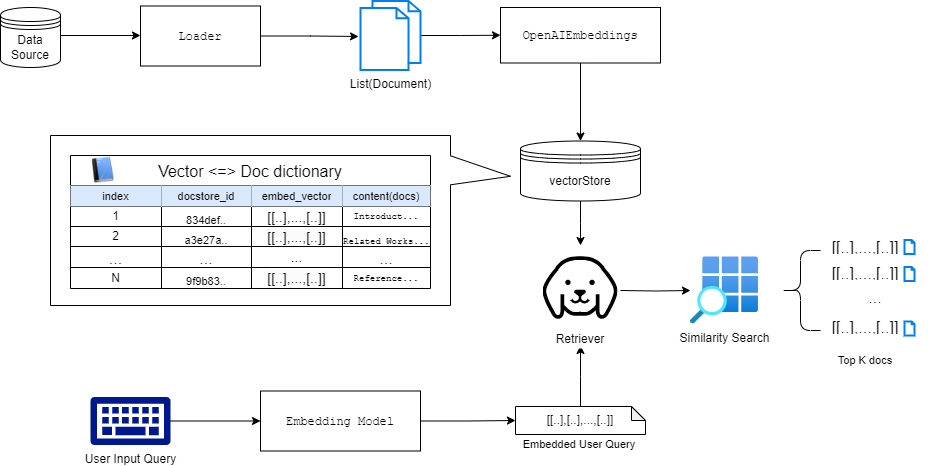
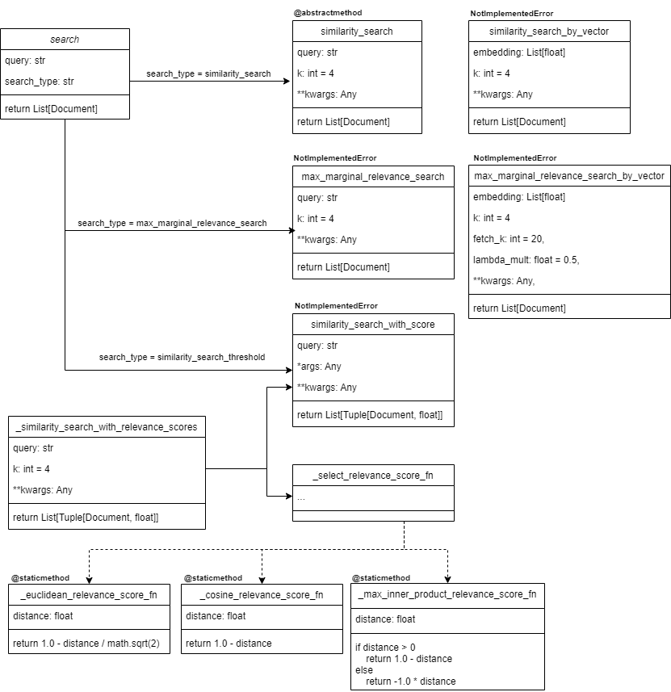

RAG는 여러 가지 구성요소를 가지고 있으나 그 중 가장 중요한 것을 뽑으라면 임베딩 모델, LM과 더불어 벡터 스토어(또는 벡터 DB)라고 말할 사람들이 많을 것이다. 사용자의 데이터들을 `Document` 형태와 페어링을 이루는 임베딩 벡터로 변환해 저장해 놓고 유저가 던지는 쿼리와 가장 유사한 `Document`를 찾아 반환하는 기능까지 수행하기에 RAG의 핵심 기능이라고 말할 수 있다.

벡터 스토어와 리트리버의 개념, 활용법에 대한 설명은 차고 넘치나 커스텀 벡터스토어, 또는 리트리버를 만드려면 어떻게 구현됐는지 알아보는 게 필요하다. 이 포스트에선 벡터 스토어(VectorStore)와 리트리버(Retriever)에 대해 간단히 살펴보고 LangChain 프레임워크 내에서 기본 베이스 클래스가 어떻게 구성되어 있는지 알아본 후에 그걸 활용한 몇가지 실제 클래스까지 알아본다. 이 포스트가 커스텀 벡터스토어, 또는 리트리버 구축에 가이드 역할을 해줄 수 있기를 바란다.

# RAG flow Overview


<div style="text-align: center; color: gray;"> RAG의 전반적인 흐름과 구성요소들 </div>

<br>

우선 RAG의 흐름을 한번 더 집고 넘어가보자(LangChain 시스템 기준). RAG 시스템은 우선 데이터 소스에서 나온 데이터를 그 특성에 따라 Loader를 통해 여러 개의 `Document` 객체로 변환한다. 이렇게 구축된 `Document`들은 벡터 스토어에서 미리 정해진 임베딩 모델에 의해 임베딩 벡터로 변환, 저장된다.

이제 사용자는 RAG에게 관련된 질문을 날린다. 이 질문은 같은 임베딩 모델에 의해 임베딩 벡터로 변환되며 미리 구축한 벡터스토어를 기반으로 생성된 리트리버는 해당 질문의 임베딩 벡터와 가장 유사한 임베딩 벡터를 가진 `Document`들을 벡터스토어의 시멘틱 검색을 통해 찾아내어 가장 유사한 순서대로 `k`의 `Document`를 반환한다.

이후 LLM 모델은 반환된 사용자의 질문과 함께 `Document`를 context 정보로 삼아 답변을 구축하고 사용자에게 전달한다.

위 과정에서 앞서 서두에서 말한 대로 벡터스토어와 리트리버의 역할은 매우 중요하며 데이터의 형태에 따라 다양한 벡터스토어, 리트리버를 사용해야할 것이다. 

<br>

# 벡터 스토어(VectorStore)

벡터 스토어는 RAG의 중요한 컴포넌트 중 하나로 비정형 데이터를 임베딩 벡터로 변환 & 저장하고 사용자의 비정형 질의 또한 임베드 하여 저장된 임베딩 벡터과 유사도를 계산, 가장 유사한 임베딩 벡터를 반환하는 기능까지 수행한다. 


<div style="text-align: center; color: gray;">그림 출처: <a href="https://python.langchain.com/v0.1/docs/modules/data_connection/vectorstores/">LangChain: Vector Stores</a> </div>

<br>

> 임베딩 벡터에 대해 간단히 설명하자면, 흔하게 관계형 DB에서 쓰이는 정형데이터는 tabalur 형태, 즉 테이블 형태로 행과 열로 구성된 정리된 데이터이다. 이러한 데이터가 아닌 자연어, 사진, 음성파일 등의 비정형 데이터를 다룰 땐 임베딩 벡터라는 형태로 변환하여 저장하고 다룬다. 

임베딩 벡터는 특정한 차원으로 정해진 숫자들의 array로 벡터 하나가 특정 객체를 표현한다고 볼 수 있다. 벡터 형태로 변환해 사용하는 이유는 계산을 하기 위함인데, 벡터 사이의 연산을 통해 벡터 사이의 유사도를 계산할 수 있으며 계산 값에 따라 벡터들, 즉 객체들이 의미적으로 유사한지 상이한지 간접적으로 알 수 있다.

벡터 스토어는 미리 정해둔 임베딩 모델을 통해 데이터를 특정 차원만큼의 크기로 정해진 임베딩 벡터로 변환 시킨뒤 저장/검색/(간단한)관리까지 통합적으로 해주는 시스템이다.

> 참고로 벡터 DB는 확장된 벡터 스토어라고 볼 수 이다. 단순히 임베딩 벡터의 변환 및 저장, 그리고 벡터 서치의 기능을 제공하는 벡터 스토어와 달리 벡터 DB는 벡터 스토어의 기본 기능에 더해 보통 DB의 다른 복합적 기능, 예를 들면 트랜젝션 관리, 메타데이터, SQL 쿼리 지원 등을 통합적으로 제공한다.

<br>

## 기본 클래스 구조 분석 : [VectorStore](https://api.python.langchain.com/en/latest/vectorstores/langchain_core.vectorstores.base.VectorStore.html#langchain_core.vectorstores.base.VectorStore.__init__)

LangChain에서의 벡터 스토어는 앞서 말한 벡터스토어의 기본 기능만을 수행하는 객체로 한정된다. 모든 벡터스토어는 기본 베이스 클래스인 `VectorStore`를 상속받아 구현된다.

`VectorStore`는 추상 클래스인 `ABC`([*참고](https://bluese05.tistory.com/61)) 를 상속받아 정의된 추상클래스이다. 따라서 상속받는 모든 하위 클래스들이 동일한 작동 구조를 따르게 하기 위한 기본적인 인터페이스의 골자만 추상적으로 정의돼 있으며 실제로 사용하기 위해선 무조건 상속받은 하위 클래스를 정의한 뒤 객체를 만들어 사용해야 한다.

`VectorStore`의 기본적인 기능들과 그 기능에 대한 관련된 대표적인 메서드들을 리스트업하면 다음과 같다.

- 생성
  - from_texts
  - from_documents
- 추가/삭제
  - add_documents
  - add_texts
  - delete
- 검색
  - id로 검색
  - 벡터 검색(시멘틱 검색)
- 리트리버 생성
  - as_retriever(아래 Retriver 섹션에서 후술)

### 벡터 스토어 생성

벡터스토어를 생성하기 위해 필요한 것은 입력으로 주어지는 스트링들의 리스트이다. 보통은 Loader를 통해 생성된 문서(Document)들의 리스트( `List[Document]`)가 입력이 주어지며 `from_documents` 라는 클래스 메서드를 호출, 여기에 입력된 `Document` 객체 각자를 하나의 임베딩 벡터로 만든다.

```python
def from_documents(
        cls: Type[VST],
        documents: List[Document],
        embedding: Embeddings,
        **kwargs: Any,
    ) -> VST: # 벡터 스토어 타입 (VST = TypeVar("VST", bound="VectorStore"))
    texts = [d.page_content for d in documents]
    metadatas = [d.metadata for d in documents]
    return cls.from_texts(texts, embedding, metadatas=metadatas, **kwargs)
```

 `from_documents`를 보면 입력으로 들어온 `List[Document]`에서 각 Document들의 page_content와 메타 데이터를 뽑아 따로 리스트로 만들고 `from_texts`라는 다른 클래스 메서드를 호출한다.

`from_texts` 는 `VectoreStores` 객체를 반환, 즉 생성하는 기능을 한다.  `@abstractmethod` 데코레이터로 꾸며진 추상 클래스이기에 상속받는 클래스에서 반드시 오버라이드로 재정의하여 사용해야 한다. 

아래 코드에서 `VST`는 벡터스토어 객체타입 또는 그 하위 클래스를 의미한다. `typing.TypeVar`를 사용해 `VST`라는 타입을 임시로 정의했고 반환 되는 객체는 `VST`, 즉 VectorStore 또는 그 하위의 클래스여야만 한다. 위의 `from_documents`에도 마찬가지로 적용돼있다.

```python
@classmethod
@abstractmethod
def from_texts(
    cls: Type[VST],
    texts: List[str],
    embedding: Embeddings,
    metadatas: Optional[List[dict]] = None,
    **kwargs: Any,
) -> VST: # 벡터 스토어 타입 (VST = TypeVar("VST", bound="VectorStore"))
```

###  Document 추가/삭제

기 구성된 vectorStore에 Document를 추가할 수 있다. `from_documents`, `from_texts`의 관계와 마찬가지로 `add_documents`와 `add_texts`가 비슷한 구조로 구현돼있다. `from_documents` 에 추가되는 `List[Document]`를 인자로 주고 page_content와 메타 데이터를 뽑아 따로 리스트로 만들고 두 리스트를 인자로 하여`self.add_texts` 를 호출해 넣어준다. `self.add_texts`는 하위 클래스에서 정의돼야 사용 가능하다. (`NotImplementedError`)

삭제 또한 `delete` 메서드로 가능하며 하위 클래스에서 정의된다. 보통은 아래 검색에서 설명할 document_id로 삭제시킨다.

### Document 검색   

#### id로 검색

검색은 크게 두가지로 나뉜다. 우선 일반적인 검색은 저장된 `Document`의 ID를 통해 수행 가능하다. 벡터스토어에 현재 저장된 `Document` 들은 `vectorStore.docstore._dict` 로 직접 볼 수 있는데, `document_id(str): Document`의 딕셔너리 형태이다. key값인 document_id를 통해 각 `Document` 객체들을 직접 인덱싱 가능하며 삭제 역시 바로 가능하다.

만약 어떤 한 Document의 ID를 알면 `self.docstore.search(_id)`로 직접 인덱싱이 가능하다. (* 기본적으로 `get_by_ids` 라는 메서드가 있는데 구현은 안되고 있는 것 같다.)

#### 시멘틱 검색

시멘틱 검색, 즉 의미적으로 검색할 수 있는 기능의 존재는 벡터 스토어나 벡터 DB를 사람들이 사용하는 가장 주된 이유일 것이다. 일반적인 검색이 단순히 단어들 간의 매칭이라면 시멘틱 검색은 벡터 스페이스 내에 존재하는 임베딩 벡터사이의 거리 또는 각도를 기반으로 한 유사도를 통한 검색을 의미한다. 

가령 `앨범` 이라는 단어와 `음반`이라는 단어는 스트링 자체로 보면 아무 연관이 없지만 그 의미적으론 상당히 유사하다는 것을 우리는 알 수 있다. 잘 훈련된 임베딩 모델을 통해 두 단어를 임베딩 벡터로 표현하면 두 벡터는 상당히 유사한 값으로 구성될 것이며 특정 차원의 공간에서 거리적으로나 각도적으로 유사하게 나타난다.

이러한 의미적 유사도를 통해 검색하는 기능을 시멘틱 검색이라고 하며 벡터스토어에선 가장 주된 기능 중 하나로 다양한 유사도 계산법에 따른 다양한 검색 메서드를 제공한다.


<div style="text-align: center; color: gray;"> 클래스 다이어그램으로 정리된 vectorStore 내 메서드들 관계도 </div>

<br>

- `search`: 이함수는 단순히 `search_type`에 따라 아래 함수들을 분기하여 실행하는 인스턴스 메서드로 override 대상이 아니다. `search_type` 파라미터에 따라 다음 함수를 실행한다.
  
    - similarity: `similarity_search`
    - similarity_score_threshold: `similarity_search_with_relevance_scores`
    - mmr: `max_marginal_relevance_search`
    - else: ValueError 리턴
    
- `similarity_search`: 가장 기본적인 시멘틱 서치 함수이다. 인자로 자연어 질문인 `query`와 반환하는 문서의 수인 `k`를 받는다. 추상 메서드(`@abstractmethod`)이기에 하위 클래스에서 필수로 override하여 사용해야 한다. `k`개의 Document의 리스트를 반환한다.
    ```py 
    @abstractmethod
    def similarity_search(self, query: str, k: int = 4, **kwargs: Any) -> List[Document]:
    ```

- `similarity_search_with_score`: `similarity_search`에서 스코어를 추가하여 반환하는 메서드이다. 따라서 리턴 타입이 `List[Tuple[Document, float]]`이다. 또한 argument를 자유롭게 받을 수 있다. 역시 `raise NotImplementedError`로 하위 클래스에서 override해야 사용 가능하다.
    ```py 
    def similarity_search_with_score(self, *args: Any, **kwargs: Any) -> List[Tuple[Document, float]]:
        raise NotImplementedError
    ```

    > 참고로  `@abstractmethod`와 `NotImplementedError`의 차이는 ABC 모듈을 사용하는지 안하는지의 차이인데, `@abstractmethod`는 해당 메서드를 하위 클래스에서 override하지 않으면 import 자체가 안되며 이와 달리 `NotImplementedError`는 하위 클래스에서 해당 메서드를 호출할 때 override 되지 않으면 에러가 발생하는 것이다. 즉 하위 클래스에서 메서드별 필수 override 대상인지 아닌지의 차이이다.

- `similarity_search_with_relevance_scores`: [0,1] 사이의 연관 스코어와 함께 `Document`들을 반환한다. 이 메서드 자체는 껍데기이며 `_similarity_search_with_relevance_scores`를 통해 로직이 구현된다. 이 메서드에선 `score_threshold`인자를 kwargs에 줘서 threshold가 일정 이상인 similarity를 가진 `Document`들만 각자의 스코어와 함께 반환해주는 것이다.
    ```py
    def similarity_search_with_relevance_scores(self,
        query: str,k: int = 4,**kwargs: Any,) -> List[Tuple[Document, float]]:
        
        (... kwargs:score_threshold 사이에 들어가는 score를 가진 Document들만 거르는 로직...)
    
        return docs_and_similarities
    ```
- `_similarity_search_with_relevance_scores`: `similarity_search_with_score` 메서드를 사용해 `k`개의 `Document` 리스트와 각자의 유사도 값을 받고 `_select_relevance_score_fn`를 통해 그 유사도를 정규화하는 함수를 선택하여 정규화된 스코어 값을 같이 반환해주는 메서드이다. 하위 클래스에서 구현대상이 아니다.

    ```py
    def similarity_search_with_relevance_scores(self,
        query: str,k: int = 4,**kwargs: Any,) -> List[Tuple[Document, float]]:
        docs_and_scores = self.similarity_search_with_score(query, k, **kwargs)
        relevance_score_fn = self._select_relevance_score_fn()
        return [(doc, relevance_score_fn(score)) for doc, score in docs_and_scores]
    ```
- `_select_relevance_score_fn` : 유사도를 정규화하여 스코어로 나타내주는 함수를 선택하는 메서드이다. 아래 나열된 static 메서드 스코어 함수들을 사용할 수 있으나 벡터스토어에 따라 다양하게 계산해야할 필요가 있기에 `raise NotImplementedError`만 적용돼있다.
    - `_euclidean_relevance_score_fn`: 정규화된 두 유닛 벡터 사이의 거리를 유클리디안 거리, 즉 L2 distance 거리를 기준으로 정규화를 수행해 [0, 1] 사이의 값으로 변환해준다. 식은 아래와 같다.
        ```py
        return 1.0 - distance / math.sqrt(2)
        ```
        - 두 유닛 벡터(단위 벡터) 사이에서 가장 유사한 경우는 방향이 아예 같을 때이며 이 경우 두 점 사이의 거리는 0이 된다. 또한 두 벡터 사이의 유사성이 가장 없는 경우는 두 벡터의 내적(dot product)가 0이 되는 케이스인데, 이 때 두 벡터는 직교(orthogonal)한 상태이다. 
        - 두 단위 벡터가 직각이라는 것은 두 점 사이의 거리가 $\sqrt2$가 된다는 의미이기도 하다. 따라서 두 단위 벡터의 유사도는 $[0, \sqrt2]$ 에 들어가며 이를 점수 [0, 1] 점수로 뒤집어 주기 위해 $1.0 - \frac{\text{distance}}{\sqrt{2}}$가 되는 것이다.
    - `_cosine_relevance_score_fn`: 설명이 충분하지 않지만.. 코사인 거리는 1 - 코사인 유사도인데 위에서 본 것 처럼 코사인 유사도는 1일 때 가장 유사한 것이고 0일때 가장 상이한 것이다. 따라서 코사인 거리는 식에 의해 반대가 되는 것이며 현 메서드에선 다시 코사인 거리를 코사인 유사도처럼 만들어 1이 가장 유사, 0이 가장 상이한 것으로 점수를 매기는 것이다.
        
        >$\text{cosine similarity} = \frac{X \cdot Y}{\|X\|_2 \cdot \|Y\|_2} = [0, 1]$
        >
        >$\text{d}_{cosine}(X, Y) = 1- \frac{X \cdot Y}{\|X\|_2 \cdot \|Y\|_2}$
    - `_max_inner_product_relevance_score_fn` : 설명 생략
- `max_marginal_relevance_search`: MMR 알고리즘을 적용하여 문서들을 반환하는 방식이다. 다른 메서드들과 달리 `fetch_k`와 `lambda_mult`라는 인자가 추가된다.
    - MMR(Maximal Marginal Relevance) 알고리즘은 문서들 사이의 거리(margin)를 최대로 하는 알고리즘 이라는 뜻으로 우선 대량으로 문서를 뽑은 뒤에 문서들 사이의 연관성을 다시 계산하여 다양한 문서들을 최종적으로 뽑고자 하는 방식이다. 식은 아래와 같다. `fetch_k`수 만큼의 각 문서 $d_i$에 대해 수행한다.
    
        > $\text{MMR}(d_i) = \lambda \cdot \text{Rel}(d_i, q) - (1 - \lambda) \cdot \max_{d_j \in S} \text{Sim}(d_i, d_j)$
    - 뽑힌 전체 문서들 중 가장 연관성이 높은 첫 문서($d_1$)은 바로 문서 집합 $S$에 넣고 이후, 각 단계에서 아직 선택되지 않은 문서들 중에서 MMR 점수가 가장 높은 문서를 선택한다. 이때, 새롭게 선택될 문서는 쿼리와의 관련성뿐만 아니라 이미 선택된 문서들과의 유사성을 동시에 고려합니다. 이는 람다 값으로 비중으로 조절한다. 이 과정을 문서 집합의 수가 `k`개가 될 때까지 반복한다.
- `similarity_search_by_vector`, `max_marginal_relevance_search_by_vector`: 앞서 봤던 `similarity_search`와 `max_marginal_relevance_search`를 쿼리에 대한 게 아닌 임베딩 벡터에 대해 수행한다. 입력 인자의 형태만 바뀔 뿐 동작은 같다.
<br>
<br>
<br>

# 리트리버(Retriever)

리트리버(반환기)는 말 그대로 `Document` 들을 반환하는 기능을 하는 컴포넌트이다. 주어진 자연어(혹은 다른 타입의 비정형 데이터)로 구성된 쿼리로 부터 연관된(relevant) `Document`들을 미리 정해진 파라미터에 따라 내어주는 기능을 주로 수행한다.

벡터 스토어와 달리 `Document`들의 임베딩 벡터를 직접 저장해놓지 않으며 그저 반환만 한다. 따라서 특정 벡터 스토어를 Backbone으로 사용하는 경우가 많다. 하지만 꼭 특정 벡터 스토어를 기반으로 구축/작동될 필요는 없다. 예를 들어 Ensemble Retriever는 특정 벡터 스토어를 기반으로 작동하는 것이 아닌 복수 개의 다른 Retriever 객체를 받아 혼합한 결과를 반환한다.

## 기본 사용법

특정 벡터 스토어를 기반으로 구축된 보통의 리트리버는 벡터 스토어의 베이스 클래스인 [vectorStore](https://api.python.langchain.com/en/latest/_modules/langchain_core/vectorstores/base.html#VectorStore.from_texts)에서 as_retriever()로 만들어진다. 아래는 한 벡터스토어 인스턴스에서 현재 벡터스토어를 사용해 VectorStoreRetriever 객체를 만들어 반환하는 단순한 코드이다.

```python
def as_retriever(self, **kwargs: Any) -> VectorStoreRetriever:
	tags = kwargs.pop("tags", None) or [] + self._get_retriever_tags()
    return VectorStoreRetriever(vectorstore=self, tags=tags, **kwargs)
```

코드를 보면 태그객체를 만들어 그것을 기반으로 `VectorStoreRetriever` 인스턴스를 생성, 반환한다. `VectorStoreRetriever`는 벡터스토어를 기반으로 한 리트리버의 한 종류로   `BaseRetriver`를 상속 받아 정의된다. `BaseRetriver` 부터 차례 대로 살펴보자.

## 기본 클래스 구조 분석

### [BaseRetriever](https://api.python.langchain.com/en/latest/retrievers/langchain_core.retrievers.BaseRetriever.html#langchain_core.retrievers.BaseRetriever)

문서 반환시스템(Document reterival system)에 대한 추상 클래스이다. 이 `BaseRetriever`를 상속받아 커스텀 리트리버를 만들 수 있다. 문서 반환 시스템이란 앞서 설명한 것과 같이 **스트링 형식의 쿼리를 받아 가장 연관된 Document들을 반환하는 행위**로 정의될 수 있다.

Retriever는 [러너블 인터페이스](https://python.langchain.com/v0.1/docs/expression_language/interface/)를 따르기에  `invoke`, `batch`, `stream` 등의 러너블 메서드들을 통해 사용된다. 또한 커스텀 Retriever를 정의할 땐 반드시`_get_relevant_documents` 메서드를 오버라이딩해서 정의해 사용해야 한다.

소스 코드상에 딱히 딥하게 알아볼 코드는 없으며 추상 메서드로 정의된`_get_relevant_documents`를 하위 클래스에서 재정의 한다는 것만 알고 가면 될 것 같다. 스트링으로 된 query를 받아 Document의 리스트를 반환한다.

```python
@abstractmethod
def _get_relevant_documents(
    self, query: str, *, run_manager: CallbackManagerForRetrieverRun
) -> List[Document]:
```

`BaseRetriver`는 위에서 살펴본 VectorStore 클래스처럼 ABC 클래스를 상속받아 정의된 추상 클래스이다. `_get_relevant_document` 메서드는 `@abstractmethod` 데코레이터가 있기에 하위 클래스에서 **반드시** 재정의를 해야 한다.

(`get_releavant_documents`는 0.1.46버전 부터 deprecated 상태이며 0.3 버전 이후부터 삭제될 예정이라고 하니 사용 안하는 게 좋을 것 같다.)


### [VectorStoreRetriever](https://api.python.langchain.com/en/latest/vectorstores/langchain_core.vectorstores.base.VectorStoreRetriever.html#langchain_core.vectorstores.base.VectorStoreRetriever)

벡터 스토어를 위한 Retriever이다. 가장 많이 사용하는 형식의 리트리버일 것이다. 기본 인스턴스 변수로 `VectorStore` 객체가 있으며 이 객체의 유사도 검색 메서드를 사용해서 `_get_relevant_documents` 메서드를 실행한다. 

다른 인스턴스 변수로 `search_type` 이 있는데  "similarity", "similarity_score_threshold", "mmr" 중 하나여야 한다. `allowed_search_types`은 클래스 변수로 list("similarity", "similarity_score_threshold", "mmr")이다. 

[코드](https://github.com/langchain-ai/langchain/blob/master/libs/core/langchain_core/vectorstores/base.py#L970) 내에서 살펴볼 것은 BaseRetriever와 마찬가지로 `_get_relevant_documents`이며 위의 세가지의 search_type 별로 분기 실행하는 if-elif-else 구문만으로 이루어진 간단한 구조의 메서드이다.

```python
def _get_relevant_documents(self, query: str, *, run_manager: CallbackManagerForRetrieverRun) -> List[Document]:
    if self.search_type == "similarity":
        docs = self.vectorstore.similarity_search(query, **self.search_kwargs)
    elif self.search_type == "similarity_score_threshold":
        docs_and_similarities = (
            self.vectorstore.similarity_search_with_relevance_scores(
                query, **self.search_kwargs
            )
        )
        docs = [doc for doc, _ in docs_and_similarities]
    elif self.search_type == "mmr":
        docs = self.vectorstore.max_marginal_relevance_search(
            query, **self.search_kwargs
        )
    else:
        raise ValueError(f"search_type of {self.search_type} not allowed.")
    return docs
```

즉 현재 리트리버에서 사용 중인 `vectorStore`에서 정의된 `similarity_search`, `similarity_search_with_relevance_scores`, `max_marginal_relevance_search`을 `search_type` 변수에 따라 다르게 쓰는 것일 뿐이다. 이 의미는 리트리버는 그저 껍데기에 불과하고 벡터 스토어에서 위 메서드들을 어떻게 정의하는지가 가장 중요다는 것이다.


## 활용 클래스 구조 분석

### [BM25Retriever](https://api.python.langchain.com/en/latest/retrievers/langchain_community.retrievers.bm25.BM25Retriever.html)

`BaseRetriever`를 상속받아 구성한 리트리버 중 알아볼 두번째 리트리버는 `BM25Retriever`이다. `BM25Retriever`는 BM25 알고리즘을 활용한 문서 반환 리트리버이다. TF-IDF 값을 사용한 기법인데 알고리즘에 대한 자세한 내용은 [문서](https://www.cs.otago.ac.nz/homepages/andrew/papers/2014-2.pdf)를 참고하면 되고 LangChain에서 어떻게 구현돼 사용되고 있는지 살펴보자.

위의 `VectorStoreRetriever`가 `vectorStore`를 갖고 있고 그 안의 search 메서드들을 활용한 `_get_relevant_documents` 메서드를 정의해 사용하는 것처럼 `BM25Retriever`는 `vectorizer`라는 인스턴스 변수를 사용해 `_get_relevant_documents` 실행시 입력 쿼리에 대해 bm25 알고리즘을 실행해 가장 유사한 `k`개의 문서를 찾아준다.

#### 리트리버 생성

먼저 리트리버를 생성해야하는데, 미리 만들어둔 벡터 스토어가 있는게 아니기에 따로 문서들을 load 해줘야한다. 벡터 스토어처럼 클래스 메서드인 `from_documents`를 사용해 `Document`리스트를 입력으로 받으면 `from_documents`안에서 `from_texts`를 호출해 `BM25Retriever`가 생성, 반환된다. 

```py
@classmethod
def from_documents(
    cls, documents: Iterable[Document], *, bm25_params: Optional[Dict[str, Any]] = None,
    preprocess_func: Callable[[str], List[str]] = default_preprocessing_func, **kwargs: Any,
) -> BM25Retriever:

# 입력으로 받은 Document들을 텍스트와 메타데이터로 분리하여 from_texts에 넣어줌
texts, metadatas = zip(*((d.page_content, d.metadata) for d in documents))
    return cls.from_texts(
        texts=texts,
        bm25_params=bm25_params,
        metadatas=metadatas,
        preprocess_func=preprocess_func,
        **kwargs,
    )

@classmethod
def from_texts(
    cls, texts: Iterable[str], metadatas: Optional[Iterable[dict]] = None,
    bm25_params: Optional[Dict[str, Any]] = None, preprocess_func: Callable[[str], List[str]] = default_preprocessing_func, **kwargs: Any,
    ) -> BM25Retriever:

    try:
        from rank_bm25 import BM25Okapi
    except ImportError:
        raise ImportError(
            "Could not import rank_bm25, please install with `pip install "
            "rank_bm25`."
        )

    # texts: Document에서 받은 page_content 텍스트들로 preprocess_func() 함수 거쳐 텍스트 더미로 만듦, preprocess_func()는 디폴트가 split() 함수
    texts_processed = [preprocess_func(t) for t in texts]
    bm25_params = bm25_params or {}
    
    # rank_bm25라이브러리에서 BM25Okapi를 임포트하여 vectorizer에 부여 
    vectorizer = BM25Okapi(texts_processed, **bm25_params)
    metadatas = metadatas or ({} for _ in texts)

    # 앞에서 나눠줬던 텍스트와 메타데이터들은 다시 Document로 구성해 저장
    docs = [Document(page_content=t, metadata=m) for t, m in zip(texts, metadatas)]
    return cls(
        vectorizer=vectorizer, docs=docs, preprocess_func=preprocess_func, **kwargs
    )
```

#### 문서 검색

검색은 매우 간단하게 구성돼있다. 우선 입력으로 받은 쿼리를 `preprocess_func(query)`로 전처리한 뒤 앞서 인스턴스 생성시 `vectorizer`변수에 부여해놓은 `BM25Okapi`의 `get_top_n`함수에 넣어 인스턴스가 가지고 있는 `Document`들 중 쿼리와 가장 유사한 상위 `k`개의 문서를 반환하는 간단한 구조이다.

```py
def _get_relevant_documents(
        self, query: str, *, run_manager: CallbackManagerForRetrieverRun
    ) -> List[Document]:
        processed_query = self.preprocess_func(query)
        return_docs = self.vectorizer.get_top_n(processed_query, self.docs, n=self.k)
        return return_docs
```

관건은 앞선 `VectorStoreRetriever`와 마찬가지로 `vectorizer.get_top_n` 메서드가 기능의 핵심이며 리트리버는 그저 통합 인터페이스의 역할을 한다는 것이다. 새로운 커스텀 리트리버를 만들 때 이러한 점을 잘 파악해 제작해야할 것이다.


### [EnsembleRetriever](https://api.python.langchain.com/en/latest/retrievers/langchain.retrievers.ensemble.EnsembleRetriever.html)

`EnsembleRetriever`는 위에서 살펴본 두 리트리버(`VectorStoreRetriever`, `BM25Retriever`)와 다르게 특정 검색기를 통해, 또는 의존해 검색하는 리트리버가 아닌 여러 개의 리트리버를 혼합해 사용하는 리트리버이다. 
`EnsembleRetriever`는 인스턴스 변수에 여러 리트리버들을 리스트로 가지고 있으며 리트리버들의 `_get_relevant_documents` 메서드의 결과들은 [Reciprocal Rank Fusion(RRF)](https://plg.uwaterloo.ca/~gvcormac/cormacksigir09-rrf.pdf) 알고리즘에 의해 혼합되어 마지막 결과를 내어 반환된다. 

예를 들어 FAISS 벡터스토어의 리트리버를 기반으로 문서를 반환하되 BM25 리트리버도 같이 사용하고 싶고 두 리트리버의 가중치를 지정해 사용하고 싶은 경우 각 리트리버 객체를 만든 뒤 `EnsembleRetriever`에 넣어주면 된다.

앞서 살펴본 두 리트리버가 다른 클래스의 로직에 의존하는 것과 달리 자체적으로 구현된 로직을 가지고 있아 코드를 분석해보면 큰 도움이 될 것 같다.

인스턴스 변수는 `retrievers: List[RetrieverLike]`, `weights: List[float]`, `c: int = 60`가 있는데 각 리트리버마다 `weight` 값을 줘서($0<= weight <= 1$) 가중 비율을 결정해줘야 하며, 명시적으로 주지 않을 경우 디폴트로 각 리트리버에 균등하게 분배해준다. `c`는 RRF 스코어 계산을 위한 상수로 60으로 고정하는 듯 하다.

앙상블 리트리터의  `_get_relevant_documents`는 아래 코드와 같이 단순 `rank_fusion`의 호출 결과이다.

```python
def _get_relevant_documents(
    self, query: str, *, run_manager: CallbackManagerForRetrieverRun,) -> List[Document]:
    # Get fused result of the retrievers.
    fused_documents = self.rank_fusion(query, run_manager)

    return fused_documents
```

중요한 것은 `rank_fusion` 메서드인데, RRF 스코어를 구하고 최종 결과를 반환하는 `weighted_reciprocal_rank` 메서드와 같이 봐야한다. 두 메서드의 내용은 다음과 같다. 

```py
def rank_fusion(self, query: str, ...) -> List[Document]:
    # 각 리트리버에서 쿼리에 대한 결과 Document들 반환, 리스트로 저장
    retriever_docs = [retriever.invoke(query) for i, retriever in enumerate(self.retrievers)]

    # 모든 결과들을 강제로 Document 형태로 저장 List[List[Document]]로 구성한 뒤 
    for i in range(len(retriever_docs)):
        retriever_docs[i] = [
            Document(page_content=cast(str, doc)) if isinstance(doc, str) else doc
            for doc in retriever_docs[i]
        ]
    # weighted_reciprocal_rank 적용 => List[Document]
    fused_documents = self.weighted_reciprocal_rank(retriever_docs)

    return fused_documents

def weighted_reciprocal_rank(self, doc_lists: List[List[Document]]) -> List[Document]:
    # rrf 스코어를 마킹할 딕셔너리 초기화
    rrf_score: Dict[str, float] = defaultdict(float)

    # 각 doc_list(List[Document]) 마다 부여한 weight 값에 따라 각 Document에 대해 RRF 값 계산 후 
    # rrf_score에 저장, 만약 동일한 문서라면 RRF 값을 더해줌
    for doc_list, weight in zip(doc_lists, self.weights):
        for rank, doc in enumerate(doc_list, start=1):
            rrf_score[
                doc.page_content
                if self.id_key is None
                else doc.metadata[self.id_key]
            ] += weight / (rank + self.c)# RRF 값은 리스트 내 문서의 rank 값이 작을수록(높을 수록) 큰 값을 가짐

    # 모든 유니크한 Document들은  최종 RRF 스코어 값에 따라 정렬되어 return 됨
    all_docs = chain.from_iterable(doc_lists)
    sorted_docs = sorted(
        unique_by_key(
            all_docs,
            lambda doc: doc.page_content
            if self.id_key is None
            else doc.metadata[self.id_key],
        ),
        reverse=True,
        key=lambda doc: rrf_score[
            doc.page_content if self.id_key is None else doc.metadata[self.id_key]
        ],
    )
    return sorted_docs
```
`weighted_reciprocal_rank`메서드를 보면 모든 리트리버에서 나온 모든 `Document` 들이 각자($d$)가 속한 `doc_list`($D$) 내에서의 순위 값($rank(d)$)과 `doc_list`에 부여된 `weight` 값($w$)에 따라 RRF 스코어를 부여받는다.

> $RRFscore(d \in D) = w * \sum \frac{1}{k + rank(d)}$

이 때 다른 `doc_list`에서 나타난 문서가 이전에 이미 있던 문서라면 RRF 값은 누적되어 쌓인다. 마지막으로 유니크한 Document들은 RRF 스코어를 기준으로 내림차순 정렬되어 반환되는 것이다.

<br>
<br>

#### 참고 링크

---
- Langchain Python API Reference(0.2.13) [[🔗](https://api.python.langchain.com/en/latest/langchain_api_reference.html)]
- LangChain: Vector Stores [[🔗](https://python.langchain.com/v0.1/docs/modules/data_connection/vectorstores/)]
- ㅍㅍㅋㄷ - Python ABC(Abstract Base Class) 추상화 클래스[[🔗](https://bluese05.tistory.com/61)]
- Trotman, A., Puurula, A., & Burgess, B. (2014, November). Improvements to BM25 and language models examined. In Proceedings of the 19th Australasian Document Computing Symposium (pp. 58-65).  [[🔗](http://www.cs.otago.ac.nz/homepages/andrew/papers/2014-2.pdf)]
- Cormack, G. V., Clarke, C. L., & Buettcher, S. (2009, July). Reciprocal rank fusion outperforms condorcet and individual rank learning methods. In Proceedings of the 32nd international ACM SIGIR conference on Research and development in information retrieval (pp. 758-759). [[🔗](https://plg.uwaterloo.ca/~gvcormac/cormacksigir09-rrf.pdf)]