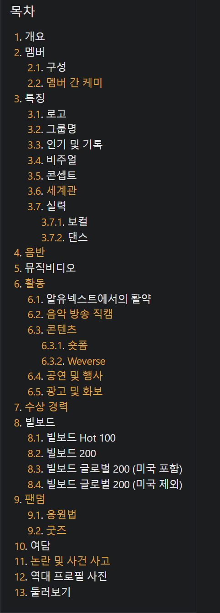

지난 [포스트](https://lymanstudio.github.io/langchain/vectorstore_retriever/)에서 Langchain의 핵심 구성 컴포넌트 중 VectorStore와 Retriever의 코드 분석을 통해 각 클래스의 구조와 활용 시 구현해야 할 메서드들의 종류, 용도에 대해 심도 있게 알아보았다.

한편 사내 관련 프로젝트를 진행하며 RAG를 위한 사내 Document들의 벡터 스토어를 구축하는 중 활용할 Document들의 메타 데이터에도 꽤나 다양한 데이터를 넣어줄 수 있었는데 이 데이터에 대해 단순 필터링을 넘어 Semantic Search도 같이 진행하면 더욱 관련 깊은 Document 반환이 가능하겠다는 생각이 들었다.

이에 Lanchain에서 기본적으로 많이 사용하는 FaissVectorStore를 기반으로 Document Content 뿐 아니라 선택한 Metadata 내 필드를 대상으로 두번 임베딩을 진행하는 `FaissMetaVectorStore`를 소개하고자 한다.

## FAISS에서 Document더미로 임베딩 벡터를 생성, 저장하는 순서

우선 FAISS의 기본 Document 소화 과정에 대해 알아보자. loader를 통해 생성해놓은 List[Document] 자료를 이용해 `FAISS`벡터스토어를 만드는 과정은 다음과 같다.

- `from_documents`, `from_texts`, `__from`이렇게 세개의 클래스 메서드를 거친 후 실제 `FAISS` 객체를 `__from`에서 생성
- `__add()` 에서 실제로 메모리에 저장, docstore도 만들어 줌

0. 코드 내 호출 블록

    ```py
    embedding = OpenAIEmbeddings()
    vectorStore = FAISS.from_documents(docs, embedding = embedding)
    ```

    

1. from_documents()

   ```py
   def from_documents(
           cls: Type[VST], # 벡터 스토어 타입
           documents: List[Document],
           embedding: Embeddings, # 임베딩 함수
           **kwargs: Any,
       ) -> VST: # 벡터 스토어 타입 (VST = TypeVar("VST", bound="VectorStore"))
       texts = [d.page_content for d in documents]
       metadatas = [d.metadata for d in documents]
       return cls.from_texts(texts, embedding, metadatas=metadatas, **kwargs)
   ```

   텍스트와 메타 데이터를 나눠 from_texts 호출하는 함수. FAISS가 아닌 기본 추상클래스인 `langchain_core.Vectorstore`에 구현되어있음

2. from_texts()
   ```py
   @classmethod # 클래스 메서드
   def from_texts(
           cls,
           texts: List[str],
           embedding: Embeddings, # 임베딩 함수
           metadatas: Optional[List[dict]] = None,
           ids: Optional[List[str]] = None,
           **kwargs: Any,
       ) -> FAISS:
       embeddings = embedding.embed_documents(texts)
       return cls.__from(
           texts,
           embeddings,
           embedding,
           metadatas=metadatas,
           ids=ids,
           **kwargs,
       )
   ```

   임베딩 함수로 텍스트들에 대해 임베딩 먼저 실행 뒤(`embed_documents()`) `__from()` 메서드에 텍스트, 임베딩들(`embeddings`), 임베딩함수(`embedding`), 메타데이터 전달 & 호출

   - embed_documents() : 처음에 인자로 넣어준 임베딩 함수에서 실행, 해당 함수가 `langchain_core.embedding.Embeddings` 를 상속받아 만든 함수라면 어떤 모델을 사용해도 상관 없음

3. __from()

   ```py
   @classmethod
   def __from(
           cls,
           texts: Iterable[str],
           embeddings: List[List[float]],
           embedding: Embeddings,
           metadatas: Optional[Iterable[dict]] = None,
           ids: Optional[List[str]] = None,
           normalize_L2: bool = False,
           distance_strategy: DistanceStrategy = DistanceStrategy.EUCLIDEAN_DISTANCE,
           **kwargs: Any,
       ) -> FAISS:
       faiss = dependable_faiss_import() ## FAISS 임포트 후 클래스 자체를 객체로 반환
       if distance_strategy == DistanceStrategy.MAX_INNER_PRODUCT:
           index = faiss.IndexFlatIP(len(embeddings[0]))
       else:
           # Default to L2, currently other metric types not initialized.
           index = faiss.IndexFlatL2(len(embeddings[0]))
       docstore = kwargs.pop("docstore", InMemoryDocstore())
       index_to_docstore_id = kwargs.pop("index_to_docstore_id", {})
       vecstore = cls(
           embedding,
           index,
           docstore,
           index_to_docstore_id,
           normalize_L2=normalize_L2,
           distance_strategy=distance_strategy,
           **kwargs,
       )
       vecstore.__add(texts, embeddings, metadatas=metadatas, ids=ids)
       return vecstore
   ```

   실제 사용될 다양한 소스들 생성 단계

   - `faiss` : faiss 클래스 자체로 엔진에 해당
   - `index`: 실제 임베딩벡터들이 들어가 있는 저장소, 벡터 간의 거리 계산 방법에 따라 다르게 구성됨
   - `docstore`: 현재 메모리에 올릴 문서 스토어, kwargs에 있으면 있던거 사용, 없으면 생성
     - `docstore`의 구조는 {`docs_store_id`: `Document`} 의 구조이다.
   - `index_to_docstore_id`:  {`index`: `docs_store_id`}로 구성된 딕셔너리,  `docstore` 와 마찬가지로 kwargs에 있으면 있던거 사용, 없으면 생성
   - `vecstore`: 이제서야 나오는 `FAISS` 벡터스토어 객체, 인자로 받고 위에서 만든 객체들을 이용해 초기화 된다. `FAISS` 클래스의 `__init__`호출로 생성

   마지막에 `__add`함수로 실제 메모리에 넣은 뒤 `vecstore`를 반환 후 종료

4. __add():
   ```py
   def __add(
           self,
           texts: Iterable[str],
           embeddings: Iterable[List[float]],
           metadatas: Optional[Iterable[dict]] = None,
           ids: Optional[List[str]] = None,
       ) -> List[str]:
       faiss = dependable_faiss_import()
   
       if not isinstance(self.docstore, AddableMixin):
           raise ValueError(
               "If trying to add texts, the underlying docstore should support "
               f"adding items, which {self.docstore} does not"
           )
   
       # texts와 metadatas의 사이즈(개수)가 같은지 체크
       _len_check_if_sized(texts, metadatas, "texts", "metadatas") 
       _metadatas = metadatas or ({} for _ in texts)
       
       # 다시 Document들을 만들어줌
       documents = [
           Document(page_content=t, metadata=m) for t, m in zip(texts, _metadatas)
       ]
   
       # documents와 embeddings, ids의 사이즈(개수)가 같은지 체크
       _len_check_if_sized(documents, embeddings, "documents", "embeddings") 
       _len_check_if_sized(documents, ids, "documents", "ids")
   	
       # ids 들이 중복이 있는지 체크
       if ids and len(ids) != len(set(ids)):
           raise ValueError("Duplicate ids found in the ids list.")
   
       # Add to the index. ## 실제 임베딩 벡터들을 index라는 곳에 저장하는 단계
       vector = np.array(embeddings, dtype=np.float32)
       if self._normalize_L2:
           faiss.normalize_L2(vector)
       self.index.add(vector)
   
       # Add information to docstore and index. ## Document와 추가 정보들을 저장하는 단계
       ids = ids or [str(uuid.uuid4()) for _ in texts]
       self.docstore.add({id_: doc for id_, doc in zip(ids, documents)})
       starting_len = len(self.index_to_docstore_id)
       index_to_id = {starting_len + j: id_ for j, id_ in enumerate(ids)}
       self.index_to_docstore_id.update(index_to_id)
       return ids
   ```

   받은 임베딩 벡터, 텍스트, 메타데이터, id 이렇게 네개의 리스트를 수량 체크 후

   - 임베딩 벡터들은 index라는 곳에 저장, 노말라이즈가 필요한면 진행
   - docstore는 id와 document의 key:value 형태로 Dictionary로 구성
   - index_to_docstore_id는 정수 형태로 index를 만들어 각 id에 부여하는 매핑 Dictionary


## 메타 데이터를 임베딩하여 저장하기 위해 필요한 수정 사항

1. Document의 Content 뿐이 아닌 메타데이터에 들어가는 문자도 임베딩 벡터로 변환하여 저장
2. 메타 데이터 중 특정 필드만을 선택하여 특정 필드의 해당하는 value 값을 임베딩 벡터로 저장
3. as_retriever() 메서드로 리트리버를 반환 시 Page Content에 대한 리트리버와 Meta데이터에 대한 리트리버를 선택하여 같은 페이지를 공유하는 두개의 리트리버를 반환할 수 있게 구성

## FaissMetaVectorStore

가장 많이 쓰이는벡터 스토어인 `FAISS`를 상속받아 활용한 벡터스토어, 기존 벡터데이터가 오로지 `Document`들의 `page_content`만 임베딩하는 것과 달리 사용자가 벡터스토어 생성시 `Document`들이 공통으로 가지고 있는 `metadata`들의 필드 중 특정 필드를 페이지 컨텐츠와 독립적으로 임베딩하여 저장함

### 기존 FAISS와 구조적 차이점

- `FAISS`가 `index`라는 벡터 저장소를 하나만 가지고 있는 것과 달리 `FaissMetaVectorStore`는 `index`, `metaindex` 두개를 가지고 있음
  - `index` : `page_content`를 임베딩한 것
  - `metaindex`: `metadata` 중 특정 key값들의 value들을 concat한 문자열을 임베딩해 갖고 있음

- 사용법 예시

    ````python
    vs_meta = FaissMetaVectorStore.from_documents(
    	docs, 
    	embedding = EMBEDDING_FUNC, 
    	metadata_fields= [ ##  리스트에 들어가는 필드명은 모든 doc들의 metadata에 공통으로 있는 key 들이어야 함
    		"metadate_field1", 
    		"metadate_field2"
        ]
    )
    ````

- as_retriever()로 리트리버를 생성 시 두 좋류의 리트리버를 생성 가능
    - `vs.as_retriever(vectorStoreType='page_content', search_kwargs={'k': k})`: 일반적인 페이지 컨텐츠 임베딩에 따른 리트리버
    - `vs.as_retriever(vectorStoreType='metadata', search_kwargs={'k': k})`: 위에서 설정한 메타 데이터 임베딩에 따른 리트리버
    - 두 리트리버를 `EnsembleRetriever`로 섞어 사용 가능

### 함수별 코드 수정

#### from_document

```python
@classmethod
def from_documents(
    cls: Type[VST],
    documents: List[Document],
    metadata_fields: List[str],
    embedding: Embeddings,
    **kwargs: Any,
) -> VST:
    texts = [d.page_content for d in documents]
    metadatas = [d.metadata for d in documents]
    return cls.from_texts(texts, embedding, metadatas=metadatas, metadata_fields = metadata_fields, **kwargs)
```


from_document는 `langchain_core.Vectorstore`에 구현된 함수로 `FaissMetaVectorStore`에서 override해야 한다. 왜냐하면 임베딩된 metadata 필드를 같이 넣어줘야하기 때문이다. 코드 내부는 특별히 수정되지 않고  인자에 `metadata_fields`가 추가되고 from_texts 함수에 `metadata_fields`를 추가로 전달해준다.


#### from_texts

```python
def concat_selected_fields_in_metadatas(
        metadatas: List[dict] = None,
        selected_fields: List[str] = None,
        separator: Optional[str] = ", " 
    ) -> List[str]:
    
    common_keys = set(metadatas[0].keys())
    for metadata in metadatas[1:]:
        common_keys.intersection_update(metadata.keys())
    
    if all(field in common_keys for field in selected_fields) == False:
        raise KeyError(
            f"One or more keys in the metadata_fields is not in the metadata dictionaries"
        )
    
    return [separator.join([str(metadata.get(field)) for field in selected_fields]) for metadata in metadatas]

...

@classmethod
def from_texts(cls,
        texts: List[str],
        embedding: Embeddings,
        metadatas: List[dict] = None,
        metadata_fields: List[str] = None,
        ids: Optional[List[str]] = None,
        **kwargs: Any,
    ) -> FaissMetaVectorStore:

    content_embeddings = embedding.embed_documents(texts)

    if metadata_fields is not None:
        metadata_texts = concat_selected_fields_in_metadatas(metadatas=metadatas, selected_fields = metadata_fields)
        metadata_embeddings = embedding.embed_documents(metadata_texts)

    return cls.__from(
        texts,
        metadata_texts = metadata_texts,
        content_embeddings=content_embeddings,
        metadata_embeddings=metadata_embeddings,
        embedding=embedding,
        metadatas=metadatas,
        ids=ids, 
        **kwargs, 
    )
```


원래는 from_documents()에서 받은 인자들에서 `embeddings = embedding.embed_documents(texts)` 만 수행한뒤 __from() 함수로 넘겨주는 것만 하는 단계이다. 

하지만 `FaissMetaVectorStore`에선 `metadata_fields`가 있을 경우 `metadata`에서 `metadata_fields`에 속한 key 필드들을 대상으로도 임베딩 벡터를 따로 만들어 __from() 에 두개의 임베딩 벡터를 전달한다.

이를 위해 concat_selected_fields_in_metadatas()를 정의해주었다. 이 함수에선

1. 메타데이터 dictionary 리스트에서 공통으로 가지고 있는 key 들인 `common_keys`를 추출한다.
2. 지정한 키들의 리스트인 `selected_fields`에 모든 원소들이 `common_keys`에 있는지 검증한다.
3. 검증이 통과되면 미리 지정한 `seperator`에 각 메타데이터에서 `selected_fields`에 해당하는 값을들 `seperator`로 이어 붙여준뒤 반환한다.

from_texts()에선 이 반환 값을 가지고 같은 임베딩 모델로 임베딩 벡터를 만든다.

- `content_embeddings`: 기존의 document 컨텐츠 임베딩 벡터
- `metadata_embeddings`: 메타 데이터 임베딩 벡터

return에서 __from() 함수를 호출할 때 `content_embeddings` 와 `metadata_embeddings`를 둘 다 보내준다.


#### __from()

```python
def __from(
        cls,
        texts: Iterable[str],
        metadata_texts: Iterable[str],
        content_embeddings: List[List[float]],
        metadata_embeddings: List[List[float]],
        embedding: Embeddings,
        metadatas: Optional[Iterable[dict]] = None,
        ids: Optional[List[str]] = None,
        normalize_L2: bool = False,
        distance_strategy: DistanceStrategy = DistanceStrategy.EUCLIDEAN_DISTANCE,
        **kwargs: Any,
    ) -> FaissMetaVectorStore:
    faiss = dependable_faiss_import()
    if distance_strategy == DistanceStrategy.MAX_INNER_PRODUCT:
        index = faiss.IndexFlatIP(len(content_embeddings[0]))
        metaindex = faiss.IndexFlatIP(len(metadata_embeddings[0]))
    else:
        # Default to L2, currently other metric types not initialized.
        index = faiss.IndexFlatL2(len(content_embeddings[0]))
        metaindex = faiss.IndexFlatL2(len(metadata_embeddings[0]))

    docstore = kwargs.pop("docstore", InMemoryDocstore())
    # metadata_docstore = kwargs.pop("docstore", InMemoryDocstore())
    index_to_docstore_id = kwargs.pop("index_to_docstore_id", {})
    # index_to_metadata_docstore_id = kwargs.pop("index_to_docstore_id", {})

    vecstore = cls(
        embedding,
        index,
        metaindex,
        docstore,
        index_to_docstore_id,
        normalize_L2=normalize_L2,
        distance_strategy=distance_strategy,
        **kwargs,
    )

    ids = vecstore.__add(
        texts, 
        embeddings = content_embeddings, 
        index = vecstore.index,
        metadatas=metadatas, 
        ids=ids
    )
    _ = vecstore.__add(
        texts, 
        embeddings = metadata_embeddings, 
        index = vecstore.metaindex,
        metadatas=metadatas, 
        ids=ids
    )
    return vecstore
```

앞서 설명했듯이 __from()에선 index와 docstore, index_to_docstore_id를 만든 후 그걸 기반으로 vectorStore 객체를 구성해 반환한다.

`FaissMetaVectorStore`에선 index와 더불어 metaindex도 만드는데 index 가 원래의 page_content의 임베딩 벡터를 가지고 있다면 metaindex는 앞서 만든 메타데이터 값 임베딩 벡터를 가진다.

결국 `FaissMetaVectorStore`는 기존 FAISS 벡터스토어에 metaindex를 같이 가지게 되며 docstore와 index_to_docstore_id는 공유하게끔 설정된다.

다만 __add()함수로 벡터 스토어에 데이터를 저장할 때 embedding과 index를 각각 다르게 두번 call하여 index와 metaindex를 따로 저장하며 docstore는 공유하는 방식으로 구성한다.


## 테스트

- 사용 데이터: 테스트를 위해 사용해볼 문서는 나무위키의 ILLIT 페이지이다. 해당 페이지는 ILLIT이라는 그룹의 전반적인 내용을 담고 있으며 매우 다양한 세션으로 이루어져있다. 목차를 보면 다음과 같다.
  

  각 목차를 하나의 document로 구성하고 목차 제목을 metadata에, 내용을 content에 할당하여 Document를 구성한다. 그리고 다른 하위 문서로 설명이 대체된 목차의 경우 하위문서에 접근, 문서 내용을 들고와 하위 문서로 구성하여 저장한다.
  예) [3.6. 세계관](https://namu.wiki/w/ILLIT#s-3.6) 목차는 [SUMMER MOON](https://namu.wiki/w/SUMMER%20MOON) 문서로 대체되어 설명되며 다른 내용은 없다. 이 경우 SUMMER MOON 문서로 들어가 내용을 가져와 저장한다.

- 모델

  - 임베딩: OPENAI의 text-embedding-ada-002
  - LLM: OpenAI의 gpt-4o

- 기타 설정

  - 질문에 대한 문서 반환 개수 k: 5

- 테스트에 사용할 Retriever
  ```python
  vs = FAISS.from_documents(docs, embedding = EMBEDDING_FUNC)
  vs_meta = FaissMetaVectorStore.from_documents(docs, embedding = EMBEDDING_FUNC, metadata_fields= ["abs_page_toc_item", "base_page_url"])
  
  ## Vanilla FAISS
  ret = vs.as_retriever(search_kwargs={'k': k})
  
  ## MetaFaissVectorStore
  ret_meta = vs_meta.as_retriever(vectorStoreType='metadata', search_kwargs={'k': k})
  ret_pc = vs_meta.as_retriever(vectorStoreType='page_content', search_kwargs={'k': k})
  ```

  - ret: 기본 `FAISS` 벡터스토어로 구성된 리트리버
  - ret_meta: `FaissMetaVectorStore`에서 메타 데이터 중 전체 목자 명과 page_url로 구성된 임베딩 벡터를 가진 리트리버
  - ret_pc: `FaissMetaVectorStore`에서 페이지 컨텐츠로 구성된 임베딩 벡터를 가진 리트리버, ret과 본질적으로 같음

- 프롬프트
  ``` python
  prompt = ChatPromptTemplate.from_template("""
      Answer the users's QUESTION based on the CONTEXT documents. Use the language that the user types in.
      If you can not find an appropriate answer, return "No Answer found.".
      CONTEXT: {context}
      QUESTION: {question}
      """)
  ```

  

### 테스트 방식

각 질문에 대해 k개의 문서를 뽑아 대략적으로 프린트한 뒤(section 명과 docment 내용 일부 출력) 답변을 출력하는 방식. ret 세개에 동일하게 적용한 결과

#### 테스트 1. Q: 아일릿의 멤버들에 대해 알려줘

- Vanilla FAISS(ret) 

  ```
  0.: Section: 팬덤/굿즈//소개
  	 걸그룹 ILLIT의 공식 굿즈들을 정리한 문서이다.
  1.: Section: 멤버/멤버 간 케미//개요
  	 ILLIT의 멤버 간 케미를 설명한 문서.
  2.: Section: 활동/음악 방송 직캠//개요
  	 대한민국 5인조 걸그룹 ILLIT의 역대 활동별 직캠 영상을 모아놓은 문서.
  3.: Section: 활동/콘텐츠//타채널/인터뷰
  	 일자,채널,제목,출연,링크,2024년,03.29,,아일릿은 평소에 뭐 하고 놀까? 따끈따끈한 아일릿 이모지 인터뷰💜,전원,,03.30, 일본 행정구 속령 모델프레스,ILLIT의 인
  4.: Section: 논란 및 사건 사고//그룹/팬덤명 논란
  	 아일릿, 팬클럽 이름 정하기 어렵네…걸그룹 선배와 겹쳐 변경 [뉴시스] 아일릿, '겹치기 논란'에 팬덤명 또 바꾼다..."여러 우려 고려" [한국일보] 2024년 4월 21일, W
  
  
  Model: gpt4o 		 elapsed_time: 1.2 
  
   Answer: No Answer found.
  ```

- FaissMetaVectorStore, metadata embedding(ret_meta) 
  ```
  0.: Section: 활동/알유넥스트에서의 활약
  	 1위,원희3,299,395점,소속사 선택(3위),소속사 선택(5위),민주2,961,696점,이로하2,569,421점,소속사 선택,소속사 선택,모카2,111,375점,윤아2,512,
  1.: Section: 활동/콘텐츠//공식채널/아일릿의 밤
  	 일자,제목,링크,2024년,07.05,※실화※ 학교 화장실 거울에서 귀신 봄 | 무서운 이야기, 가위 눌린 썰, 일본 괴담 | 민주의 심야 괴담 모임,,07.26,"이거 지면 아일
  2.: Section: 역대 프로필 사진
  	 ,,,ILLIT,SUPER REAL ME,I’LL LIKE YOU, ,,,ILLIT,SUPER REAL ME,I’LL LIKE YOU,
  3.: Section: 팬덤//GLLIT인 인물
  	 김채현 - Kep1er 멤버KBS cool FM '이은지의 가요광장'에 출연하여, 친해지고 싶은 아이돌로 아일릿을 꼽으며, "아일릿이 너무 귀여워서 키링으로 만들고 싶다고 했을 정
  4.: Section: 멤버/멤버 간 케미//멤버 간 케미/3인/윤아 + 원희 + 이로하
  	 해당 섹션에 대한 설명이 없거나 하위 문서로 대체됩니다.
  
  
  Model: gpt4o 		 elapsed_time: 6.2 
  
   Answer: 아일릿의 멤버들은 다음과 같습니다:
  
  1. **원희**: 최종 데뷔조에서 1위를 차지한 멤버로, 다양한 무대에서 활동하였습니다. 주요 무대로는 "Dreams Come True", "FEARLESS", "우주를 건너 보컬A" 등이 있습니다.
  
  2. **민주**: 소속사 선택에서 3위를 기록한 멤버로, "Bad Girl Good Girl", "FEARLESS", "4 Walls" 등의 무대에 올랐습니다.
  
  3. **이로하**: 소속사 선택에서 5위를 기록한 멤버로, "달라달라", "Given-Taken", "The Boys" 등의 무대에서 활약했습니다.
  
  4. **모카**: "TOMBOY", "Attention", "Dream of You" 등의 무대에 참여한 멤버입니다.
  
  5. **윤아**: "Bad Girl Good Girl", "Attention", "The Boys" 등의 무대에서 활동한 멤버입니다.
  
  아일릿은 다양한 무대와 노래로 팬들에게 사랑받고 있으며, 여러 아티스트와의 협업 및 팬들과의 교류를 통해 인기를 끌고 있습니다.
  ```

- FaissMetaVectorStore, PageContent embedding(ret_pc) 
  ```
  0.: Section: 팬덤/굿즈//소개
  	 걸그룹 ILLIT의 공식 굿즈들을 정리한 문서이다.
  1.: Section: 멤버/멤버 간 케미//개요
  	 ILLIT의 멤버 간 케미를 설명한 문서.
  2.: Section: 활동/음악 방송 직캠//개요
  	 대한민국 5인조 걸그룹 ILLIT의 역대 활동별 직캠 영상을 모아놓은 문서.
  3.: Section: 활동/콘텐츠//타채널/인터뷰
  	 일자,채널,제목,출연,링크,2024년,03.29,,아일릿은 평소에 뭐 하고 놀까? 따끈따끈한 아일릿 이모지 인터뷰💜,전원,,03.30, 일본 행정구 속령 모델프레스,ILLIT의 인
  4.: Section: 논란 및 사건 사고//그룹/팬덤명 논란
  	 아일릿, 팬클럽 이름 정하기 어렵네…걸그룹 선배와 겹쳐 변경 [뉴시스] 아일릿, '겹치기 논란'에 팬덤명 또 바꾼다..."여러 우려 고려" [한국일보] 2024년 4월 21일, W
  
  
  Model: gpt4o 		 elapsed_time: 1.2 
  
   Answer: No Answer found.
  ```


#### 테스트 2. Q: 음반에 대해 설명해줘

- Vanilla FAISS(ret)
  ```
  0. Section: 활동/공연 및 행사//개요
  	 ILLIT의 공연 및 행사를 서술한 문서이다.
  
  1. Section: 활동/콘텐츠//개요
  	 ILLIT의 콘텐츠에 대해 정리한 문서.
  
  2. Section: 멤버/멤버 간 케미//개요
  	 ILLIT의 멤버 간 케미를 설명한 문서.
  
  3. Section: 활동/공연 및 행사//컴백쇼/ILLIT : I'LL (SHOW) IT
  	 다음 문서로 대체 설명: https://namu.wiki/w/ILLIT%20:%20I'LL%20(SHOW)%20IT
  
  4. Section: 활동/공연 및 행사//콘서트/단독 콘서트
  	 해당 섹션에 대한 설명이 없거나 하위 문서로 대체됩니다.
  
  
  Model: gpt4o 		 elapsed_time: 1.1 
  
   Answer: No Answer found.
  ```

  

- FaissMetaVectorStore, metadata embedding(ret_meta) 
  ```
  0. Section: 음반//개요
  	 걸그룹 ILLIT이 발매한 음반을 서술한 문서  ,,,,SUPER REAL ME미니 1집2024. 03. 25.,I’LL LIKE YOU미니 2집2024. 10. 21.,,,
  1. Section: 음반//초동 판매량
  	  초동 판매량 추이,미니 1집 SUPER REAL ME 2024.03.25,380,0**,미니 2집 I’LL LIKE YOU2024.10.21,382,6**,,50만(|),
  2. Section: 음반//일본 음반
  	 해당 섹션에 대한 설명이 없거나 하위 문서로 대체됩니다.
  3. Section: 음반//한국 음반
  	 해당 섹션에 대한 설명이 없거나 하위 문서로 대체됩니다.
  4. Section: 음반//음원 성적/빌보드
  	     HOT 100,#,연도,곡명,최고 순위,차트인,비고,1,2024,《Magnetic》,91위,1주,,  200,#,연도,앨범명,최고 순위,차트인,비고,1,2024,《SUPER
  
  
  Model: gpt4o 		 elapsed_time: 3.5 
  
   Answer: 걸그룹 ILLIT은 2024년에 두 장의 미니 앨범을 발매했습니다. 첫 번째 미니 앨범인 'SUPER REAL ME'는 2024년 3월 25일에 발매되었으며, 초동 판매량은 약 38만 장을 기록했습니다. 두 번째 미니 앨범인 'I’LL LIKE YOU'는 2024년 10월 21일에 발매되어 초동 판매량 약 38만 2천 장을 기록했습니다. 'SUPER REAL ME' 앨범은 빌보드 200 차트에서 93위에 올랐으며, 수록곡 'Magnetic'은 빌보드 HOT 100 차트에서 91위, GLOBAL 200 차트에서 6위에 오르며 각각 1주, 20주 동안 차트에 머물렀습니다.
  ```

  

- FaissMetaVectorStore, PageContent embedding(ret_pc) 
  ```
  0. Section: 활동/공연 및 행사//개요
  	 ILLIT의 공연 및 행사를 서술한 문서이다.
  1. Section: 활동/콘텐츠//개요
  	 ILLIT의 콘텐츠에 대해 정리한 문서.
  2. Section: 멤버/멤버 간 케미//개요
  	 ILLIT의 멤버 간 케미를 설명한 문서.
  3. Section: 활동/공연 및 행사//컴백쇼/ILLIT : I'LL (SHOW) IT
  	 다음 문서로 대체 설명: https://namu.wiki/w/ILLIT%20:%20I'LL%20(SHOW)%20IT
  4. Section: 활동/공연 및 행사//컴백쇼
  	 해당 섹션에 대한 설명이 없거나 하위 문서로 대체됩니다.
  
  
  Model: gpt4o 		 elapsed_time: 1.1 
  
   Answer: No Answer found.
  ```