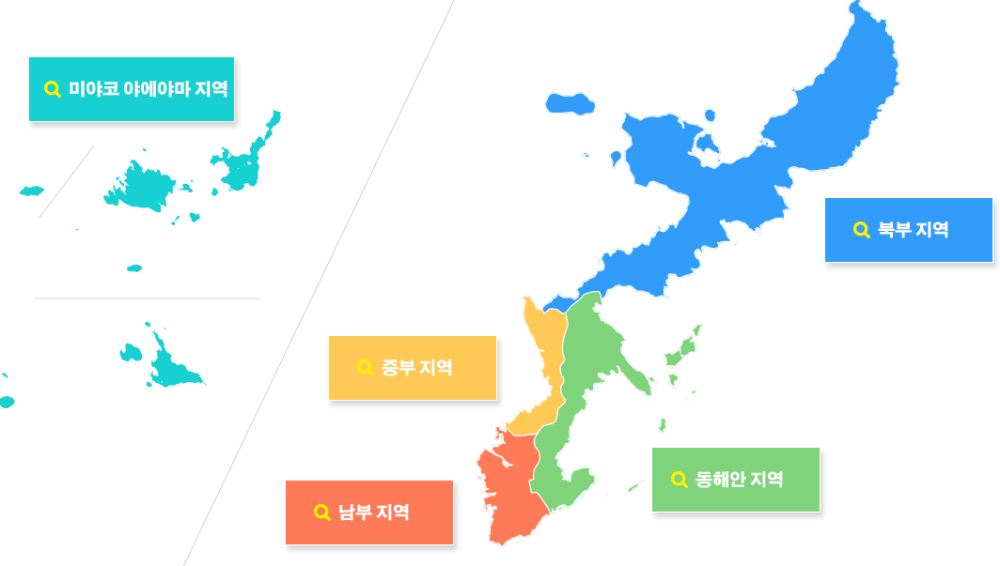
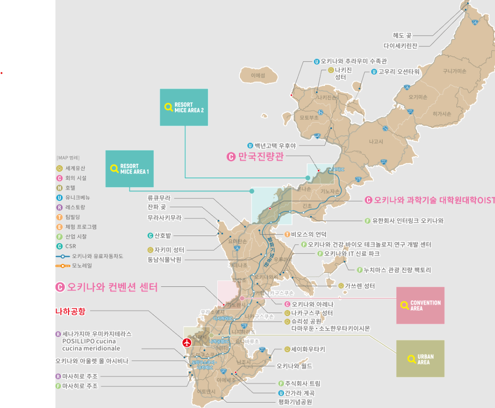

## 오키나와 지리/명소 및 교통

### 🌎 지리

- 남부 지역: 오키나와의 관문인 나하공항과 나하항이 있고, 국제 거리 등을 중심으로 고도 도시 기능이 집적된 지역, 나하를 중심으로 한 시내가 있으며 비지니스용 호텔 등이 많음
  - 명소: 오키나와 국제 거리, 슈리성
  - 행정 구역: 나하시、이토만시、도미구스쿠시 등
- 중부 지역: 서해안을 중심으로 리조트 호텔과 푸드, 쇼핑, 컨벤션, 항만, 레크리에이션 등의 시설이 한데 모여 도시 근교형 비치 리조트가 형성된 국제적인 스타일의 관광, 컨벤션 지역으로 미국의 거리 풍경이 융합된 이국적인 미하마 아메리칸 빌리지, 류큐 왕조의 역사와 전통문화를 체험할 수 있는 관광지가 있다고 함
  - 명소: 아메리칸 빌리지, 잔파곶, 류큐무라
  - 행정 구역: 기노완시、우라소에시、요미탄촌、가데나초、차탄초
- 동해안 지역: 오키나와시, 우루마시 등 주거지역이 많음, 세계유산 나카구스쿠 성터, 가쓰렌 성터와 간가라 계곡 등의 관광지
  - 명소: 오키나와 월드, 성터, 간가라 계곡
  - 행정 구역: 오키나와시, 우루마시, 난조시 등
- 북부지역: 가장 넓으면서 자연환경이 좋다고 함. 해안이 매우 아름다우며, 오키나와 해안 국정 공원으로도 지정되어 있는 서해안 지역에는 여러 곳의 리조트 호텔이 많음. 사람의 손이 닿지 않은 자연이 남아 있는 얀바루의 숲에는 희귀한 동식물들이 다수 서식
  - 명소: 만좌모, 추라우미 수족관, 나고 파인애플 파크, 비세마을, 얀바루 숲
  - 행정 구역: 나고시、구니가미손、오기미손 등
- [여행 동선 참고](https://brunch.co.kr/@yunjo/197)

### 🚐 교통

- 항공편: 관문 공항인 나하공항으로 감
  - 인천 to 오키나와: 2024.05.08 (수) 13:30 ~ 15:45(예정), 편명: `7C1802`
  - 오키나와 to 인천: 2024.05.13 (월) 16:45 ~ 18:55(예정), 편명: `7C1801`
  
- 모노레일: 오키나와 유일한 철도선
  - 노선도
  - 도시 지역만 이동 가능해보임, 위 교통 지도에서 UNBAN AREA만 커버하는 정도
  - 비용이 매우 비쌈, 기본요금(3km까지)은 230엔이며, 4~6km는 270엔, 7~9km는 300엔, 10~13km는 340엔, 14~17km는 370엔
  - 승차권을 사면 3~4번만 타도 이득이라고 함. 참고로 날짜기준이 아닌 시간 기준이기에 이틀탈 때 한번만 끊으면 된다고 함
  
- 렌트카
  - [카모아](https://carmore.kr/home/)에서 오키나와 렌탈 업체 모아서 서비스 제공, 나하 공항에서 픽업해줌
  - 5/8~5/13까지 6일 기준 준중형차 기준(보험료 포함) 30만원 안쪽
    
    - 짐 두개 넣을 수 있는 차 기준 싸면 24만원
    
    - 예약: 도요타 아쿠아 레몬 렌트카
    
      - 대여지점 정보
    
        **지점명 :** LEMON RENTACAR
    
        **주소 :** 沖縄県与根306−4 (Please contact the store to get the pick up inforamtion after you book the car.Telephone/LINE/WHATSAPP/KAKAO:+81 8064969966）
    
        **영업시간**: 08:30 ~ 22:00
    
        **전화번호 :** +81 8064969966
    
        **가는 방법 :**
        공항밖에 있어요. 도착시 직원에게 전화하셔서 픽업을 요청하세요.
  
  - 예약번호 :  **KL30636**
  
  - 주행은 무제한이라고 써있으며 쏘카처럼 주행비용 따로 지불이 아닌 우리가 주유하면서 다녀야 함
    - 보통 꽉찬 상태로 대여해주며 반납 전 다시 까득 채우기
  - 팁 및 주의할 점([참고 링크](https://brunch.co.kr/@yunjo/197), [참고 영상](https://www.youtube.com/watch?v=_1Jb3rj1zMg))
    - 기본 규칙
      - 우리 나라와 달리 우회전 좌회전 신호가 따로 있는 경우가 많이 없음
      - 파란불이 모든 차선에 대한  go  신호
        - 하지만 우선 순위가 있음
          1. 보행자(좌우회전 시)
          2. 직진
          3. 좌회전
          4. 우회전
        - 유턴은 우회전과 동일하게 취급
        - 반대 차선  가로지르기가 불법이 아님
        - 우회전 시 수평 신호등 신경 X 내 원래 직진시 신호등 기준으로 가면 됨
        - 토마레 시 일단 정지
    - 주차에 엄격, 꼭 지정된 장소에 하기, 보통 관광지 주차는 현금만 되며 30분에 200엔 꼴
    - 구글맵 이용, 톨게이트 비용은 비싼편으로 많이 돌아다니면 몇천엔 나온다고 함
    - 주유는 직접하는 경우도 있음, 보통 리터당 1500원 정도, 기계에 현금 넣어 사용, 키오스크에서 거스름돈 받는다 함

# 숙박

- [프린스 스마트 인 나하](https://maps.app.goo.gl/xZZEFARNkgagnhLr8)
  - 5/8~5/9
  - 차 주차 하려면 건물 뒤편으로 가서 직원 호출
    - 주차비 1000엔
  - 체크인은 키오스크로 하면 됨
  - 조식은 오전 6시 30분 - 오전 9시 30분 사이에 1층 카페로 카드키를 가지고 내려가셔서 세 가지 메뉴 중 하나 선택 [출처](https://blog.naver.com/bbangs0927/223405038944)
    - 핫도그는 9시 넘어가면 솔드 아웃
  - 예약 번호: `1205192824`

### 🌅 리조트

- [ANA 인터컨티넨탈 만자 비치 리조트](https://www.google.com/travel/hotels/s/GspnAwyU6YuxDygg9)
  - 주요 관광지 중 하나인 만자곶 주변에 위치 섬 딱 중간쯤에 있으며 작은 곶 전체를 부지로 사용하고 있음
  - 방은 그냥 저냥 적당하게 좋은데 뷰가 장난아님, 전 객실이 오션뷰이며 선셋 뷰가 절경이라고 함 우리는 라군 뷰
  - 웨이크 보드, 혹등고래 투어 등 다양한 액티비티 가능
  - 주차 하루에 천
  - 조식은 뷔페식과 가이세키식 두곳 운영
  - 예약 번호: `1205223756`
- [하얏트 리젠시 세라가키 아일랜드](https://www.google.com/travel/hotels/s/YnA4VZHkNREheMxo9)
  - 4.5성급, 인기가 좋고 유명함
  - 동남아 관광지 리조트 느낌이 강하다고 함, 안에서 버기타고 다님
    - 주차 하루에 1000엔 있다고 함
  - 실내 수영장/사우나있고 프라이빗 비치 2개, 카누 카약 액티비티
  - 조식은 해산물이 좋다고 함, 도보로 10분 거리에 다양한 음식점도 있음
  - 예약 번호: `32085307636`

# 관광

-  추미우리 수족관
   - 입장료: 대인 2180엔
     - 쿄다 휴게소에서 입장권을 사면 1850엔이라고 함([링크](https://m.blog.naver.com/me6746/223105221804))
-  슈리성
   - 규모가 큰 성터이지만 19년 화재로 만이 전소됐다고 함
   - 유료구역 무료구역 나눠져 있는데 전망이 좋은 곳은 유료, 날씨 좋으면 가면 좋을 듯
     - 입장료 400
     - 주차비 400엔 정

- [구글 관광 플레이스](https://maps.app.goo.gl/Ay6HYxr8YbhgikGi7)

# 맛집/카페 리스트

- [식당리스트](https://maps.app.goo.gl/afBuSQzLCUA8dqSK7)
- [카페리스트](https://maps.app.goo.gl/j3QN3y2ASCxxADr58)

# 일정

- 첫째날
  차 픽업 - 체크인 - 아메리칸빌리지 (스테이크) - 일몰감상 - 블루씰아이스크림 - 숙소 갔다가 - 나하 국제거리 - 돈키호테

- 둘째날
  오전 호텔조식 간단하게 - 슈리성 - 트로피칼비치 - 아메리칸빌리지 (버거) - 카페 - 푸른 동굴 / 마에다곶 / 자네비치 - 카페 - 잔파곶 - 저녁

- 셋째날

- 넷째날
  인터컨티네탈 조식 후 런닝 - 11시 코우리 - 효다휴게소(타코가 맛있음 + 티켓) - 츄라우미 - 비세자키 - 오아세스시(포장?) - 호텔 구경 - 일몰 - 저녁(외식)

- 다섯째날
  조식 - 요가/러닝 - 수영 - 뇨뇨하기
  점심 / 저녁? 리조트 안에서?

- 여섯째날
